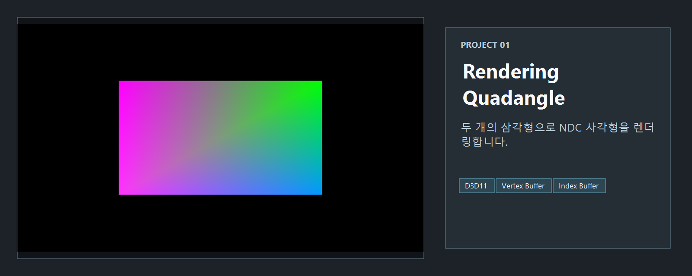
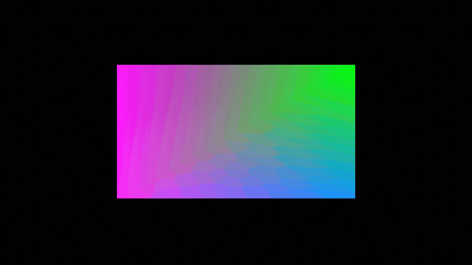

<!-- README-NAV-TOP:START -->

이전 | [메인](../../README.md) | [상위](../) | [다음](../02_RenderingCube/README.md)

<!-- README-NAV-TOP:END -->

<!-- README-INFO:START -->

<!-- README-INFO:END -->

## 01. RenderingQuadangle

<!-- README-BRAND:START -->

<!-- README-BRAND:END -->
- 내용: NDC 좌표계를 기반으로 두 개의 삼각형을 그려 사각형을 렌더링  
- 주요 구현:
  - Vertex / Index Buffer 생성
  - Input Layout 및 Shader 연결
  - `IASetPrimitiveTopology` 를 이용한 삼각형 리스트 설정
- 결과: 화면 중앙에 사각형 출력

  

---

<!-- README-RUNTIME:START -->
## 실행 화면

| Screenshot | GIF |
|---|---|
|  |  |
<!-- README-RUNTIME:END -->

<!-- README-NAV-BOTTOM:START -->

이전 | [메인](../../README.md) | [상위](../) | [다음](../02_RenderingCube/README.md)

<!-- README-NAV-BOTTOM:END -->
