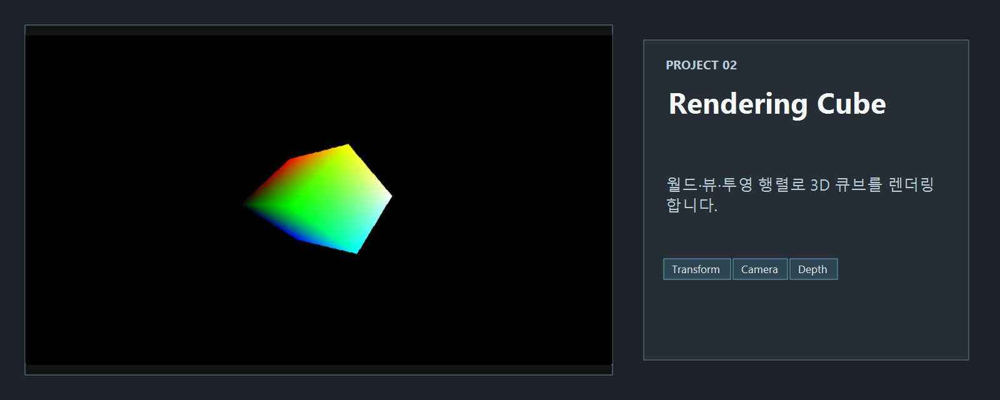
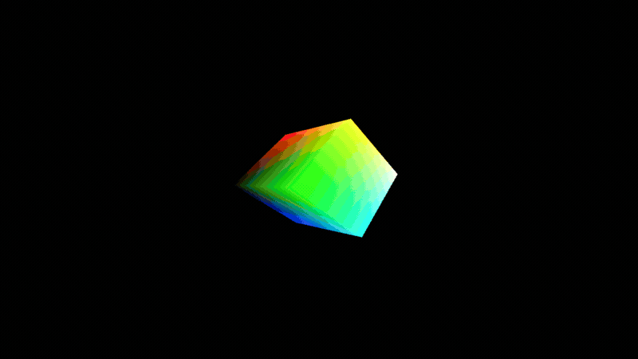

<!-- README-NAV-TOP:START -->

[이전](../01_RenderingQuadangle/README.md) | [메인](../../README.md) | [상위](../) | [다음](../03_RenderingMeshAndSceneGraph/README.md)

<!-- README-NAV-TOP:END -->

<!-- README-INFO:START -->

<!-- README-INFO:END -->

## 02. RenderingCube

<!-- README-BRAND:START -->

<!-- README-BRAND:END -->
- 내용: 단일 큐브를 렌더링
- 주요 구현:
  - 큐브 정점/인덱스 버퍼 구성 (24 정점, 36 인덱스)
  - 기본 Vertex/Pixel Shader와 Input Layout 연결
  - `DrawIndexed` 호출로 큐브 렌더링
- 결과: 화면에 큐브 1개가 렌더링됨

  

<!-- README-RUNTIME:START -->
## 실행 화면

| Screenshot | GIF |
|---|---|
|  |  |
<!-- README-RUNTIME:END -->

<!-- README-NAV-BOTTOM:START -->

[이전](../01_RenderingQuadangle/README.md) | [메인](../../README.md) | [상위](../) | [다음](../03_RenderingMeshAndSceneGraph/README.md)

<!-- README-NAV-BOTTOM:END -->
