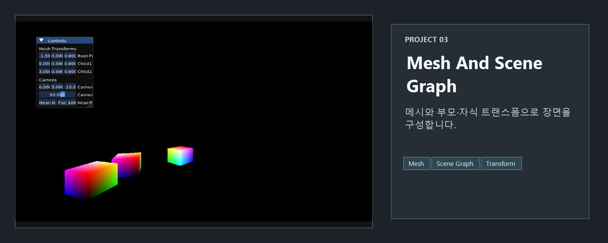
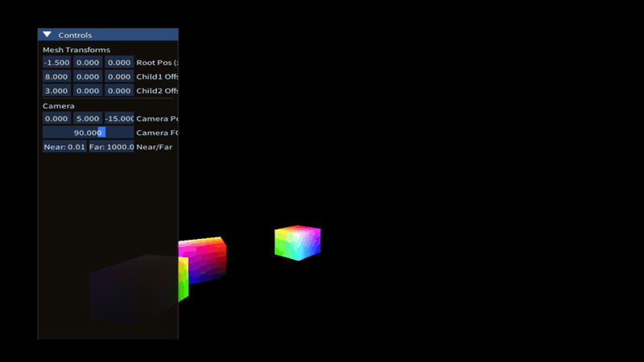

<!-- README-NAV-TOP:START -->

[이전](../02_RenderingCube/README.md) | [메인](../../README.md) | [상위](../) | [다음](../04_RenderingMeshWithTexture/README.md)

<!-- README-NAV-TOP:END -->

<!-- README-INFO:START -->

<!-- README-INFO:END -->

## 03. RenderingMeshAndSceneGraph

<!-- README-BRAND:START -->

<!-- README-BRAND:END -->

- 내용: 부모-자식 계층(Scene Graph)으로 3개의 메쉬를 렌더링
- 주요 구현:
  - `m_CBuffers`에 3개의 상수 버퍼 데이터를 유지
  - 부모-자식 변환: `world = local * parentWorld` 적용
  - 루트와 자식1은 서로 다른 Yaw 속도로 회전, 자식2는 자식1을 중심으로 공전
  - Depth Buffer 및 DepthStencilState 활성화(Z-test)
  - ImGui로 루트/자식 상대 위치, 카메라 위치/FOV/Near/Far 실시간 조정
- 결과: 계층 변환과 깊이 테스트가 올바르게 동작하는 다중 메쉬 장면

  

<!-- README-RUNTIME:START -->
## 실행 화면

| Screenshot | GIF |
|---|---|
|  |  |
<!-- README-RUNTIME:END -->

<!-- README-NAV-BOTTOM:START -->

[이전](../02_RenderingCube/README.md) | [메인](../../README.md) | [상위](../) | [다음](../04_RenderingMeshWithTexture/README.md)

<!-- README-NAV-BOTTOM:END -->
