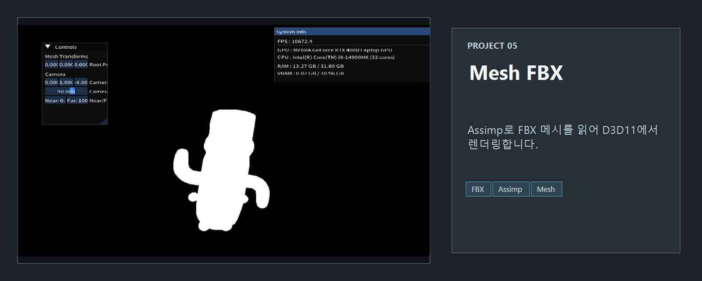
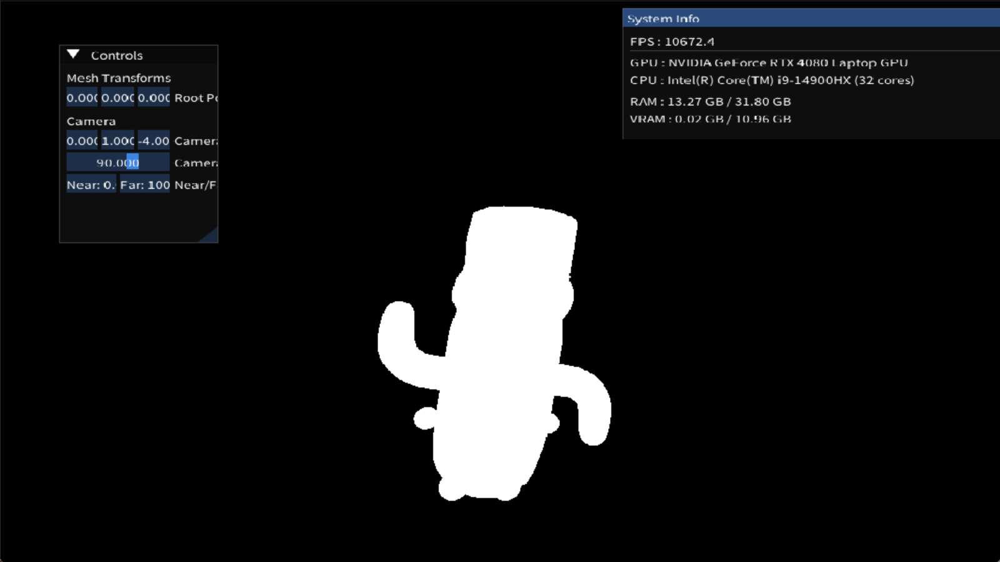
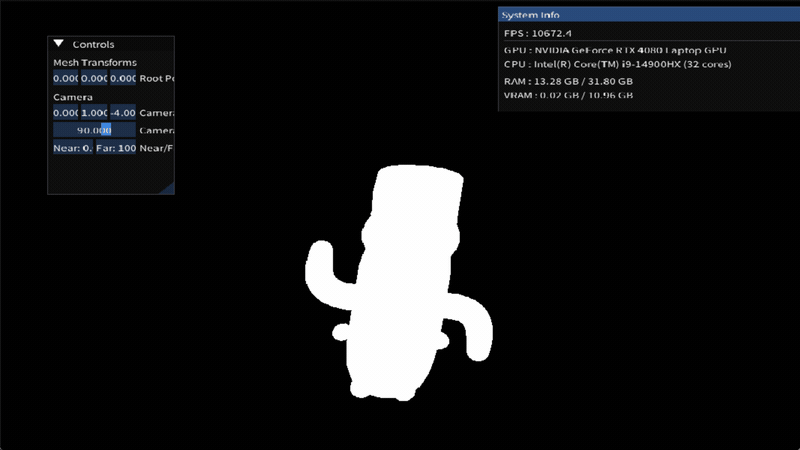

<!-- README-NAV-TOP:START -->

[이전](../04_RenderingMeshWithTexture/README.md) | [메인](../../README.md) | [상위](../) | [다음](../06_pmx/README.md)

<!-- README-NAV-TOP:END -->

<!-- README-INFO:START -->

<!-- README-INFO:END -->

## 05. Mesh (FBX)
- 내용: FBX 메시를 로드해 머티리얼별 서브셋을 렌더링
- 주요 구현:
  - Assimp로 FBX 로드, 노드 계층(Global Transform) 적용 병합
  - 머티리얼 DIFFUSE 텍스처 로드(외부 경로/임베디드 둘 다 처리, 실패 시 흰색 폴백)
  - 현재는 하얀색으로만 그림
  - `VertexPosTex`(POSITION, TEXCOORD) + 텍스처 전용 HLSL + 샘플러
  - Rasterizer Cull None, Depth 테스트 활성화
  - ImGui로 루트 위치/카메라(FOV/Near/Far) 조정
- 결과: 머티리얼/텍스처가 적용된 FBX 메시 렌더링

  

<!-- README-RUNTIME:START -->
## 실행 화면

| Screenshot | GIF |
|---|---|
|  |  |
<!-- README-RUNTIME:END -->

<!-- README-NAV-BOTTOM:START -->

[이전](../04_RenderingMeshWithTexture/README.md) | [메인](../../README.md) | [상위](../) | [다음](../06_pmx/README.md)

<!-- README-NAV-BOTTOM:END -->
