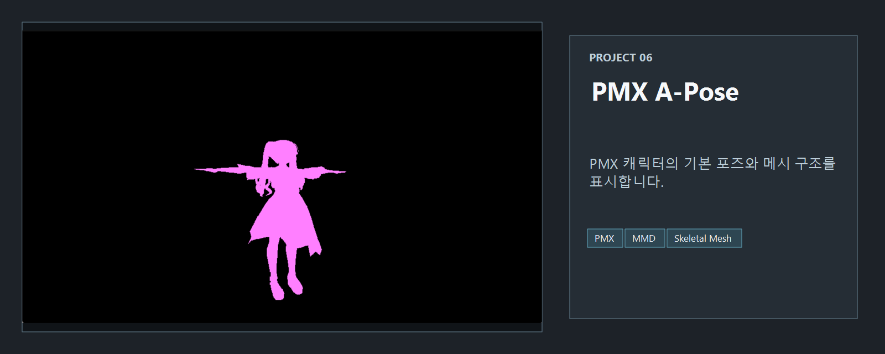
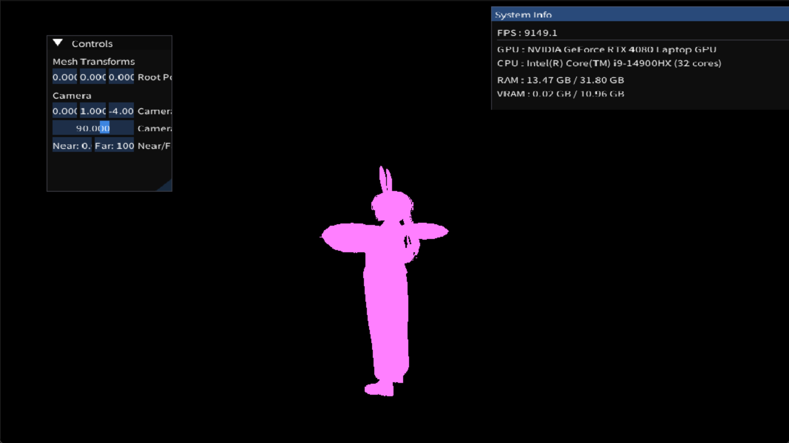

<!-- README-NAV-TOP:START -->

[이전](../05_Mesh/README.md) | [메인](../../README.md) | [상위](../) | [다음](../07_pmxTexture/README.md)

<!-- README-NAV-TOP:END -->

<!-- README-INFO:START -->

<!-- README-INFO:END -->

## 06. PMX (A-Pose)

<!-- README-BRAND:START -->
<!-- README-BRAND:END -->

- 내용: PMX 캐릭터를 A-포즈 실루엣(흰색)으로 단순 렌더링
- 주요 구현:
  - Assimp로 PMX 로드, 노드 계층(Global Transform) 적용 병합
  - AABB 기반 중심 이동/스케일 정규화, 카메라 자동 설정
  - 텍스처/머티리얼 생략(픽셀 셰이더 고정 마젠타색)
  - Rasterizer Cull None, Depth 테스트 활성화
  - ImGui로 루트 위치/카메라(FOV/Near/Far) 조정
- 결과: 화면에 PMX A-포즈 캐릭터 실루엣 표시
  

  

<!-- README-RUNTIME:START -->
## 실행 화면

| Screenshot | GIF |
|---|---|
|  |  |
<!-- README-RUNTIME:END -->

<!-- README-NAV-BOTTOM:START -->

[이전](../05_Mesh/README.md) | [메인](../../README.md) | [상위](../) | [다음](../07_pmxTexture/README.md)

<!-- README-NAV-BOTTOM:END -->
