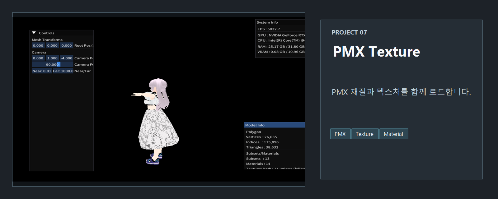
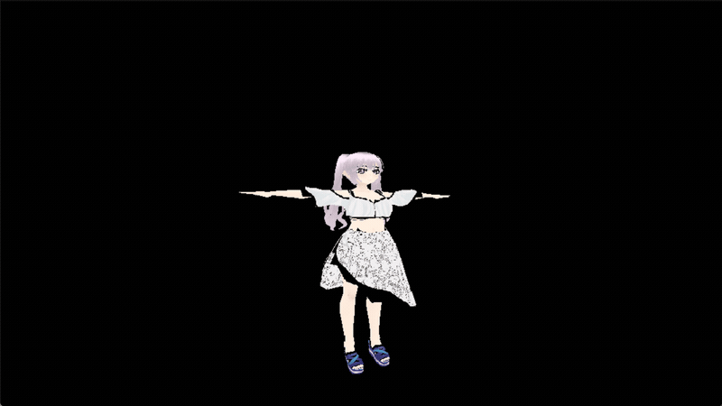

<!-- README-NAV-TOP:START -->

[이전](../06_pmx/README.md) | [메인](../../README.md) | [상위](../) | [다음](../08_ImguiSystemInfo/README.md)

<!-- README-NAV-TOP:END -->

<!-- README-INFO:START -->

<!-- README-INFO:END -->

## 07. PMX Texture (07_pmxTexture)

<!-- README-BRAND:START -->
<!-- README-BRAND:END -->

- 이미지를 클릭하면 이동합니다

| [유튜브](https://www.youtube.com/watch?v=JmdBz3NbKB0) | [블로그](https://velog.io/@whoamicj/DX11PMX-07pmxTexture-PMX-%ED%85%8D%EC%8A%A4%EC%B3%90-%EB%A7%A4%ED%95%91) |
|---|---|
| 
 
 | 
 
 |

- 내용: PMX 모델에 텍스쳐 매핑을 완성한 예제
- 주요 구현:
  - 머티리얼 DIFFUSE 텍스쳐 로딩: 외부 경로 + 모델 파일명 기반 `.fbm/` 폴더 폴백, 임베디드(`*0`) 텍스쳐 처리
  - Subset/Material 기반 드로우: 서브셋마다 SRV 바인딩 후 `DrawIndexed`
  - 샘플러/폴백: 선형 필터(Linear), Wrap, 로딩 실패 시 1x1 흰색 텍스처 폴백
  - 좌표/상태: Left-Handed, Rasterizer Cull None, Depth 테스트(LESS)
  - 셰이더: `TexVertexShader.hlsl`(POSITION/TEXCOORD), `TexPixelShader.hlsl`(텍스쳐 샘플링)
  - 카메라: RMB 드래그 회전(Yaw/Pitch), WASD 이동, Q/E 상승·하강, 마우스 휠 돌리(뷰 방향)
  - ImGui: System Info + Model Info(Vertices/Indices/Triangles/Subsets/Materials/Textures unique/fallback, Model Path, Texture Folder)
- 프로젝트: `07_pmxTexture/`
- 리소스 예시: `Resource/fbx/Public/MyAlice/Player/SampleModel.glb`, 텍스처 폴더 `SampleModel.fbm/`

  
  

<!-- README-RUNTIME:START -->
## 실행 화면

| Screenshot | GIF |
|---|---|
|  |  |
<!-- README-RUNTIME:END -->

<!-- README-NAV-BOTTOM:START -->

[이전](../06_pmx/README.md) | [메인](../../README.md) | [상위](../) | [다음](../08_ImguiSystemInfo/README.md)

<!-- README-NAV-BOTTOM:END -->
