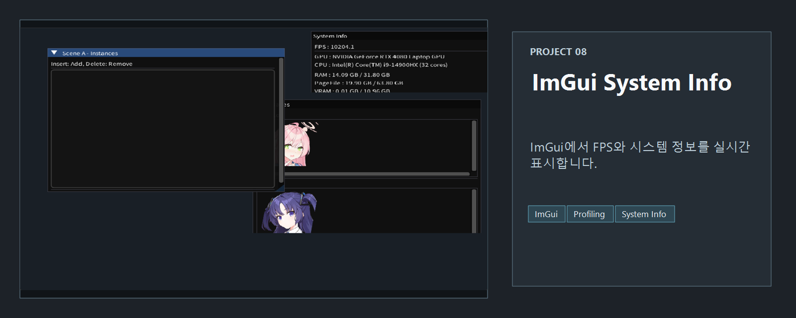
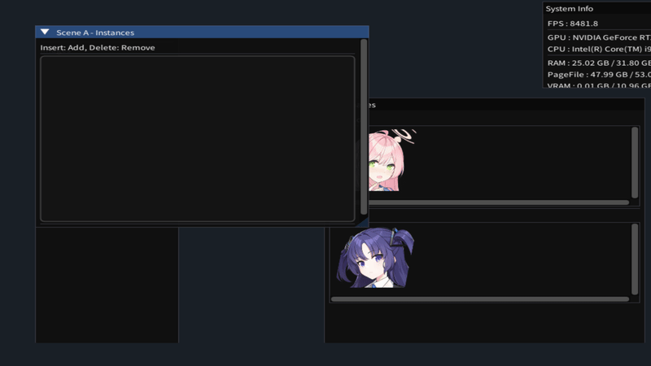

<!-- README-NAV-TOP:START -->

[이전](../07_pmxTexture/README.md) | [메인](../../README.md) | [상위](../) | [다음](../09_Lighting/README.md)

<!-- README-NAV-TOP:END -->

<!-- README-INFO:START -->

<!-- README-INFO:END -->

## 08. ImguiSystemInfo (08_ImguiSystemInfo)
- 내용: ImGui로 시스템 정보와 간단한 이미지 뷰어(파일 열기 포함)를 구현한 예제
- 주요 구현:
  - System Info: FPS(1초 갱신), GPU/CPU, RAM/VRAM, page file 표시
  - Controls: Hanako/Yuuka 기본 이미지 크기 조절, 종횡비 고정/해제, Fit To Window/512/Fit Image, 파일 열기(탐색기)
  - 이미지 뷰어: Hanako/Yuuka 고정 슬롯 + 외부 파일 전용 슬롯(Loaded Image)
- 프로젝트: `08_ImguiSystemInfo/`

  

  

  

<!-- README-RUNTIME:START -->
## 실행 화면

| Screenshot | GIF |
|---|---|
|  |  |
<!-- README-RUNTIME:END -->

<!-- README-NAV-BOTTOM:START -->

[이전](../07_pmxTexture/README.md) | [메인](../../README.md) | [상위](../) | [다음](../09_Lighting/README.md)

<!-- README-NAV-BOTTOM:END -->
