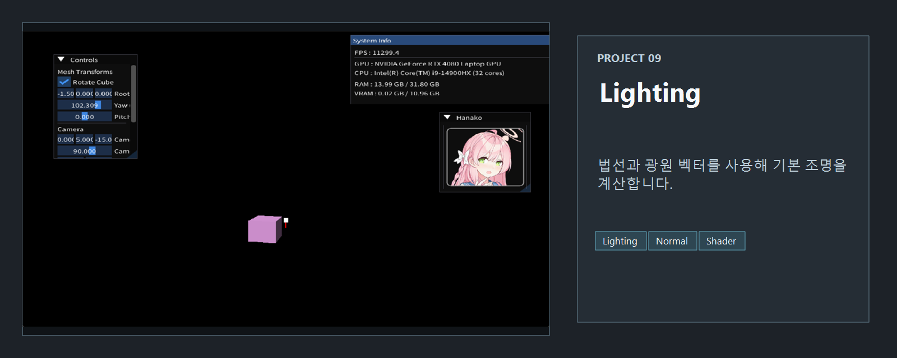
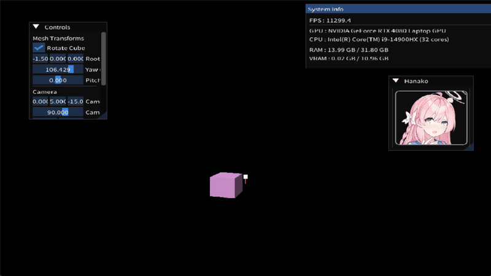

<!-- README-NAV-TOP:START -->

[이전](../08_ImguiSystemInfo/README.md) | [메인](../../README.md) | [상위](../) | [다음](../10_StaticCube_SkyBox/README.md)

<!-- README-NAV-TOP:END -->

<!-- README-INFO:START -->

<!-- README-INFO:END -->

## 09. Lighting (09_Lighting)

<!-- README-BRAND:START -->
<!-- README-BRAND:END -->

- 내용: Directional Light로 큐브를 비추는 예제
- 주요 구현:
  - Vertex: POSITION/NORMAL/COLOR, NORMAL을 VS에서 월드 노말로 변환(g_WorldInvTranspose)
  - ConstantBuffer(b0): world/view/proj/worldInvTranspose/dirLight/eyePos/pad
  - Pixel Shader: baseColor * (ambient + diffuse), pad로 디버그 모드(보라색/흰색 마커)
  - ImGui Controls: Mesh(Yaw/Pitch/Position), Camera(FOV/Near/Far), Light(Color/Direction/Position)
  - Light Marker: 라이트 위치에 작은 흰색 큐브 렌더링(스케일 0.2)

  

<!-- README-RUNTIME:START -->
## 실행 화면

| Screenshot | GIF |
|---|---|
|  |  |
<!-- README-RUNTIME:END -->

<!-- README-NAV-BOTTOM:START -->

[이전](../08_ImguiSystemInfo/README.md) | [메인](../../README.md) | [상위](../) | [다음](../10_StaticCube_SkyBox/README.md)

<!-- README-NAV-BOTTOM:END -->
