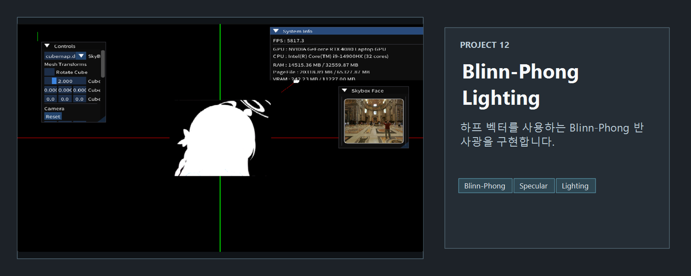
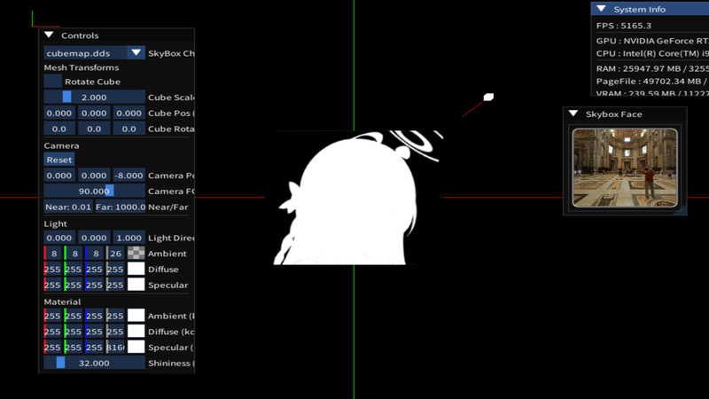

<!-- README-NAV-TOP:START -->

[이전](../11_Live2D/README.md) | [메인](../../README.md) | [상위](../) | [다음](../13_LineRenderer_AxisDebug/README.md)

<!-- README-NAV-TOP:END -->

<!-- README-INFO:START -->

<!-- README-INFO:END -->

## 12. Blinn Phong (12_Lighting_BlinnPhong)
- 내용 : Blinn Phone 쉐이더를 사용한 라이팅 예제입니다
- 주요 구현
  - Material은 `ambient`, `diffuse`, `specular`, `reflect`를 가지고 있음
  - Ambient는 현재 가지고 있는 메테리얼의 ambient와 빛의 ambient를 곱해 구합니다
  - Diffuse에 normal과 light 두 벡터의 내적값을 반영함 (theta를 넣음)
  - Specular는 반사광과 시선벡터 사이의 중간 벡터로 구현
 

<!-- README-RUNTIME:START -->
## 실행 화면

| Screenshot | GIF |
|---|---|
|  |  |
<!-- README-RUNTIME:END -->

<!-- README-NAV-BOTTOM:START -->

[이전](../11_Live2D/README.md) | [메인](../../README.md) | [상위](../) | [다음](../13_LineRenderer_AxisDebug/README.md)

<!-- README-NAV-BOTTOM:END -->
