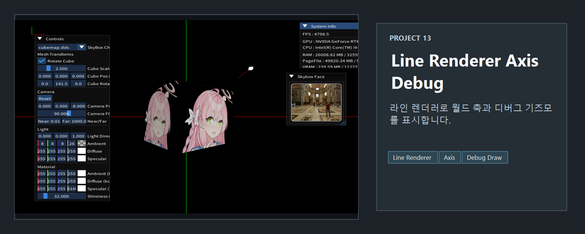
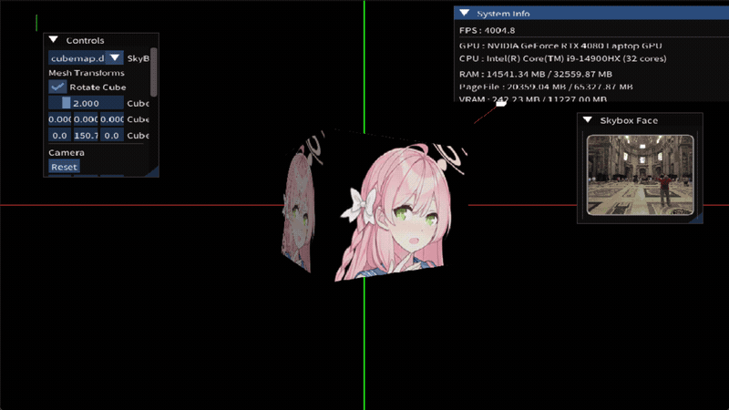

<!-- README-NAV-TOP:START -->

[이전](../12_Lighting_BlinnPhong/README.md) | [메인](../../README.md) | [상위](../) | [다음](../14_Lighting_Phong/README.md)

<!-- README-NAV-TOP:END -->

<!-- README-INFO:START -->

<!-- README-INFO:END -->

## 13. LineRenderer (13_LineRenderer_AxisDebug)

<!-- README-BRAND:START -->
<!-- README-BRAND:END -->

- 내용 : LineRenderer를 사용한 좌표축 디버그 예제입니다
- 주요 구현
  - LineRenderer로 원하는 위치까지 라인을 그려냅니다
  - 픽셀 셰이더에서 패딩값 3번을 라인 렌더러로 사용 합니다
  - 라인의 색을 반영해서 그려냅니다
  - 실제 좌표축을 2D화시켜서 NDC 좌표에 그려닙니다

<!-- README-RUNTIME:START -->
## 실행 화면

| Screenshot | GIF |
|---|---|
|  |  |
<!-- README-RUNTIME:END -->

<!-- README-NAV-BOTTOM:START -->

[이전](../12_Lighting_BlinnPhong/README.md) | [메인](../../README.md) | [상위](../) | [다음](../14_Lighting_Phong/README.md)

<!-- README-NAV-BOTTOM:END -->
