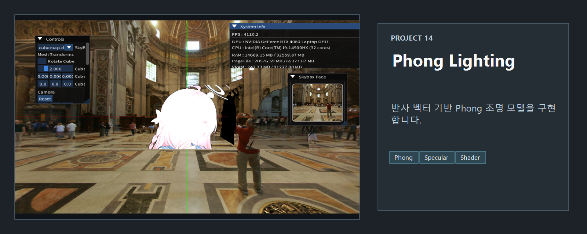
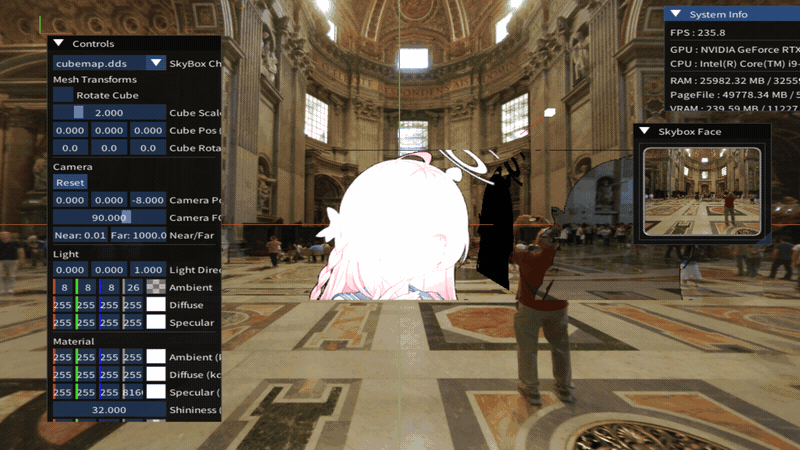

<!-- README-NAV-TOP:START -->
<div align="center">

[이전](../13_LineRenderer_AxisDebug/README.md) | [메인](../../README.md) | [상위](../) | [다음](../15_pmxWithPhong/README.md)

</div>
<!-- README-NAV-TOP:END -->

<!-- README-INFO:START -->
<p align="center"></p>
<!-- README-INFO:END -->

## 14. LightingPhong (14_Lighting_Phong)


- 이미지를 클릭하면 이동합니다

| [유튜브](https://www.youtube.com/watch?v=k1ex_n8N5AU) | [블로그](https://velog.io/@whoamicj/DX11-14LightingPhong-Phong-%EC%85%B0%EC%9D%B4%EB%94%A9-%EC%95%8C%ED%8C%8C-%ED%88%AC%EB%AA%85%EC%B2%98%EB%A6%AC-%EB%9F%AC%ED%94%84%EB%8B%88%EC%8A%A4) |
|---|---|
| <div align="center">[](https://www.youtube.com/watch?v=k1ex_n8N5AU)<br/></div> | <div align="center">[](https://velog.io/@whoamicj/DX11-14LightingPhong-Phong-%EC%85%B0%EC%9D%B4%EB%94%A9-%EC%95%8C%ED%8C%8C-%ED%88%AC%EB%AA%85%EC%B2%98%EB%A6%AC-%EB%9F%AC%ED%94%84%EB%8B%88%EC%8A%A4)<br/></div> |


- 내용 : LightingPhong을 사용한 쉐이더 예제입니다.
- 주요 구현
  - LightingPhong 쉐이더를 사용합니다
  - Material의 Shiness인 g_Material.specular.w를 1까지 줄였을때 빛의 반대 방향에 Specular가 적용되는 문제
  - normal 벡터와 light 벡터를 내적한 결과 NdotL과
  - normal 벡터와 eye 벡터를 내적한 결과 NdotV
  - 이 둘을 곱한 결과가 0보다 클때를 나타내는 변수를 만듭니다.
    - specGate = saturate(sign(theta)) * saturate(sign(NdotV));
  - 이 specGate를 specularScalar에 곱합니다.


  - 투명은 다음처럼 텍스쳐 컬러의 알파값에 메테리얼의 난반사 알파 값을 곱해서 만들어 둡니다.
  - 마지막 컬러 값의 알파에 덮어쓰기 하면 됩니다
  ```
  float alphaTex = textureColor.a * g_Material.diffuse.a;
  clip(alphaTex - 0.1f);
  ......
  litColor.a = alphaTex;
  ```

- 참고 사이트

  
https://dicklyon.com/tech/Graphics/Phong_TR-Lyon.pdf

https://google.github.io/filament/Filament.md.html

https://graphics.pixar.com/library/ReflectanceModel/paper.pdf

https://discussions.unity.com/t/bug-in-all-specular-shaders-causing-highlights-from-light-sources-behind-objects/432906/4


<!-- README-RUNTIME:START -->
## 실행 화면

| Screenshot | GIF |
|---|---|
|  |  |
<!-- README-RUNTIME:END -->

<!-- README-NAV-BOTTOM:START -->
<div align="center">

[이전](../13_LineRenderer_AxisDebug/README.md) | [메인](../../README.md) | [상위](../) | [다음](../15_pmxWithPhong/README.md)

</div>
<!-- README-NAV-BOTTOM:END -->
