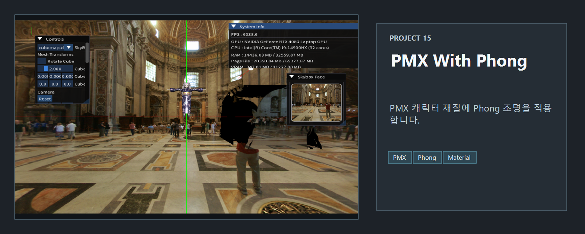
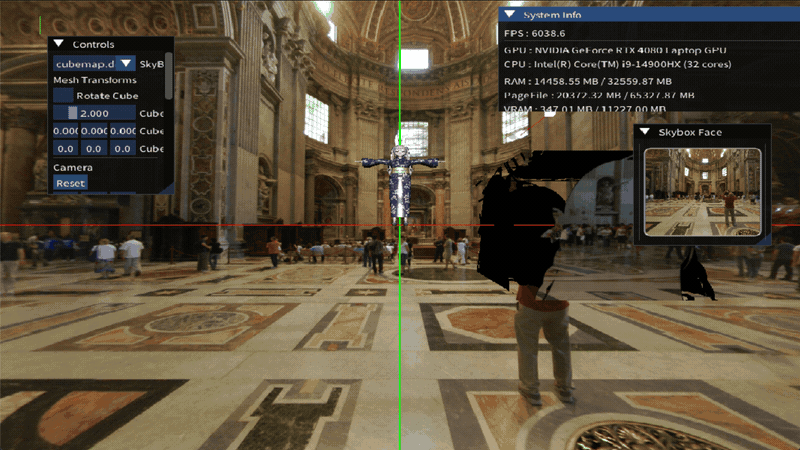

<!-- README-NAV-TOP:START -->

[이전](../14_Lighting_Phong/README.md) | [메인](../../README.md) | [상위](../) | [다음](../16_NormalMapping/README.md)

<!-- README-NAV-TOP:END -->

<!-- README-INFO:START -->

<!-- README-INFO:END -->

## 15. pmxWithPhong (15_pmxWithPhong)

<!-- README-BRAND:START -->
<!-- README-BRAND:END -->

- 내용 : Phong 쉐이딩을 사용한 pmx 로더 예제입니다.
- 주요 구현
  - Phong 쉐이더를 사용합니다
  - 지금까지 만든 쉐이더를 선택할 수 있게 합니다
  - padding 값을 ShaderMode 이름으로 해두고 이를 바꿔가면서 각각의 쉐이더를 선택할 수 있게 했습니다

###  Phong

### Blinn-Phong

### Lambert

### Unlit

### TextureOnly

<!-- README-RUNTIME:START -->
## 실행 화면

| Screenshot | GIF |
|---|---|
|  |  |
<!-- README-RUNTIME:END -->

<!-- README-NAV-BOTTOM:START -->

[이전](../14_Lighting_Phong/README.md) | [메인](../../README.md) | [상위](../) | [다음](../16_NormalMapping/README.md)

<!-- README-NAV-BOTTOM:END -->
