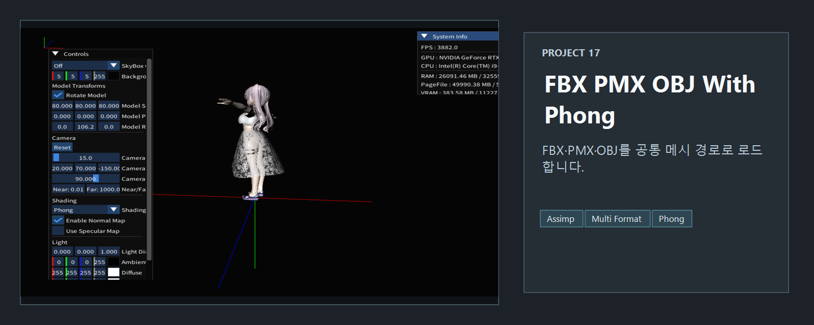
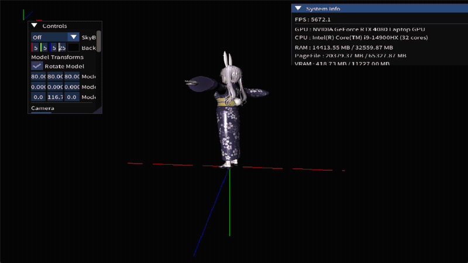

<!-- README-NAV-TOP:START -->

[이전](../16_NormalMapping/README.md) | [메인](../../README.md) | [상위](../) | [다음](../18_fbx_Animation/README.md)

<!-- README-NAV-TOP:END -->

<!-- README-INFO:START -->

<!-- README-INFO:END -->

## 17. fbx_pmx_obj (17_fbx_pmx_obj_WithPhong)

- 내용 : Phong Shading을 사용하고 fbx, pmx, obj 모델을 로드하여 렌더링하는 프로젝트입니다.
- 주요 구현
  - assimp에서 모델 파일 안에 텍스처가 있는지 확인합니다. 만약 있다면 그 텍스처를 사용합니다.
  - 없다면 모델에 정의되어 있는 텍스처 경로를 탐색합니다.
  - 메시는 scene->mMeshes[node->mMeshes[mi]]; 에 접근해서 메시 데이터를 가져옵니다
  - TBN의 Tangent값은 assimp 안에 있는 mTangents 값을 사용합니다
  - TBN의 Bitangents값은 assimp 안에 있는 mBitangents값을 사용합니다
  - TBN의 Normal값은 assimp 안에 있는 mNormals값을 사용합니다
  - 각 노드의 position 데이터는 mVertices에서 가져옵니다.
  - 마지막으로 쉐이더에게 값을 전달하면 됩니다.
 

| fbx - Phong  | fbx - Blinn Phong  |
|--------------|--------------------|
| 
 
 | 
 
 |

| fbx - Lambert | fbx - TextureOnly  |
|--------------|-------------------|
| 
 
 | 
 
 |

 
## In blender

| blender - no light  | blender - Sun Light  |
|---|---|
| 
 
 | 
 
 |
 
## PMX

| pmx - Phong  | pmx - Blinn Phong  |
|---|---|
| 
 
 | 
 
 |

| pmx - Lambert | pmx - TextureOnly  |
|---|---|
| 
 
 | 
 
 |

## FBX

| fbx - Phong  | fbx - Blinn Phong  |
|---|---|
| 
 
 | 
 
 |

| fbx - Lambert | fbx - TextureOnly  |
|---|---|
| 
 
 | 
 
 |

| fbx - Phong  | fbx - Blinn Phong  |
|--------------|--------------------|
| 
 
 | 
 
 |

| fbx - Lambert | fbx - TextureOnly  |
|--------------|-------------------|
| 
 
 | 
 
 |

## OBJ

| obj - Phong  | obj - Blinn Phong  |
|---|---|
| 
 
 | 
 
 |

| obj - Lambert | obj - TextureOnly  |
|---|---|
| 
 
 | 
 
 |

<!-- README-RUNTIME:START -->
## 실행 화면

| Screenshot | GIF |
|---|---|
|  |  |
<!-- README-RUNTIME:END -->

<!-- README-NAV-BOTTOM:START -->

[이전](../16_NormalMapping/README.md) | [메인](../../README.md) | [상위](../) | [다음](../18_fbx_Animation/README.md)

<!-- README-NAV-BOTTOM:END -->
