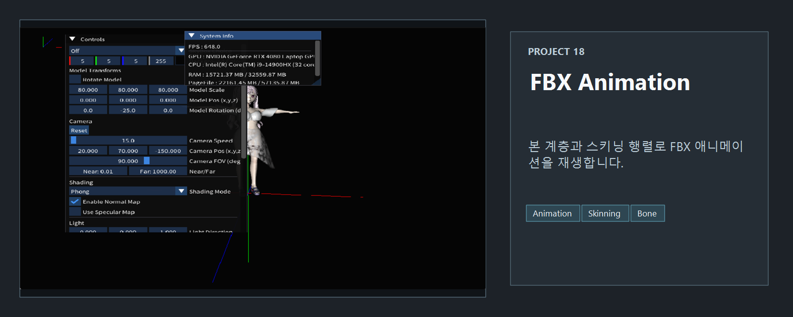
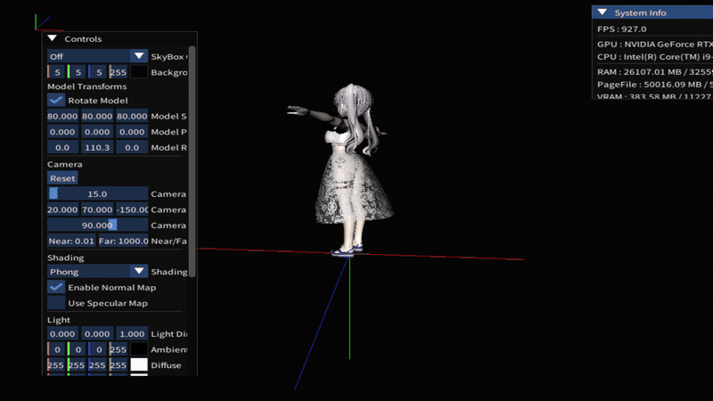

<!-- README-NAV-TOP:START -->

[이전](../17_fbx_pmx_obj_WithPhong/README.md) | [메인](../../README.md) | [상위](../) | [다음](../19_MultiModels/README.md)

<!-- README-NAV-TOP:END -->

<!-- README-INFO:START -->

<!-- README-INFO:END -->

## 18. fbx Animation (18_fbx_Animation)

<!-- README-BRAND:START -->

<!-- README-BRAND:END -->

- 내용 : 본 구조가 있는 캐릭터 fbx 파일에 내장되어 있는 애니메이션을 재생하는 예제입니다.
- 주요 구현
  - 본 구조를 정의합니다
  - 트랜스폼의 부모-자식 관계를 정의하고 각 트랜스폼에 맞게 SRT 적용, MVP를 적용합니다.
  - CPU에서 그리게 되면 매우 느려지기 때문에, 쉐이더에게 그리도록 해야합니다.
  - 버텍스가 매우 많은 모델도 그려낼 수 있도록 본 버퍼의 최대 개수를 1023개로 설정했습니다.

| fbx Bone Structure |
|---|
| 

 |

| fbx Animation - Phong  | fbx Animation - Blinn Phong  |
|---|---|
| 
 
 | 
 
 |

| fbx Animation - Lambert | fbx Animation - TextureOnly  |
|---|---|
| 
 
 | 
 
 |

| fbx Animation - No Lighting |
|---|
| 

 |

<!-- README-RUNTIME:START -->
## 실행 화면

| Screenshot | GIF |
|---|---|
|  |  |
<!-- README-RUNTIME:END -->

<!-- README-NAV-BOTTOM:START -->

[이전](../17_fbx_pmx_obj_WithPhong/README.md) | [메인](../../README.md) | [상위](../) | [다음](../19_MultiModels/README.md)

<!-- README-NAV-BOTTOM:END -->
