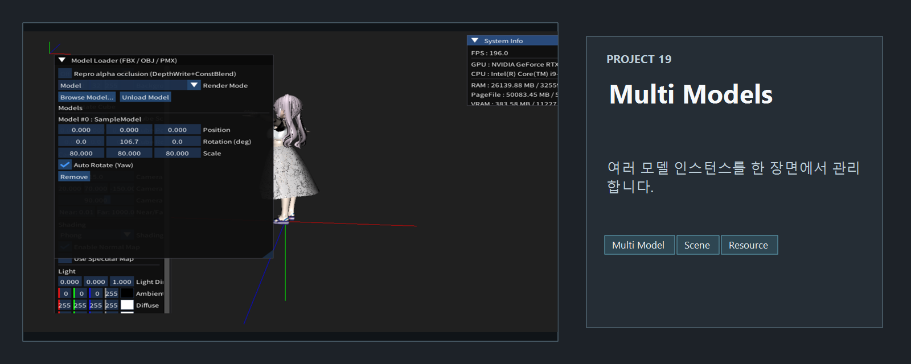
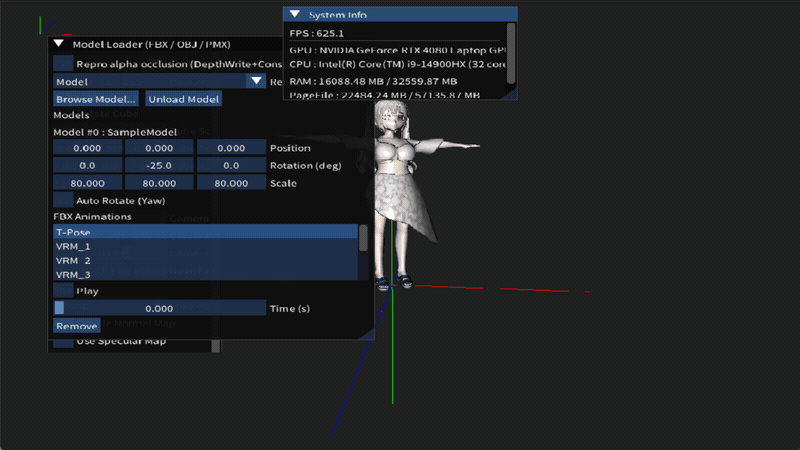

<!-- README-NAV-TOP:START -->

[이전](../18_fbx_Animation/README.md) | [메인](../../README.md) | [상위](../) | [다음](../20_Depth_And_Alpha_Issue/README.md)

<!-- README-NAV-TOP:END -->

<!-- README-INFO:START -->

<!-- README-INFO:END -->

## 19. fbx, obj, pmx MultiModels (19_MultiModels)

- 내용 : 여러 모델을 동시에 렌더하는 예제입니다
- 주요 구현
  - 17번 프로젝트에서 완성한 모델 렌더 로직에서 모델을 그리기 위한 ModelEntry를 정의합니다.
  - 그 ModelEntry를 vector를 사용해 그려냅니다

| MultiModels - Phong  | MultiModels - Blinn Phong  |
|---|---|
| 

 | 

 |

| MultiModels - No Lighting |
|---|
| 

 |

| MultiModels - Lambert | MultiModels - TextureOnly  |
|---|---|
| 

 | 

 |

<!-- README-RUNTIME:START -->
## 실행 화면

| Screenshot | GIF |
|---|---|
|  |  |
<!-- README-RUNTIME:END -->

<!-- README-NAV-BOTTOM:START -->

[이전](../18_fbx_Animation/README.md) | [메인](../../README.md) | [상위](../) | [다음](../20_Depth_And_Alpha_Issue/README.md)

<!-- README-NAV-BOTTOM:END -->
