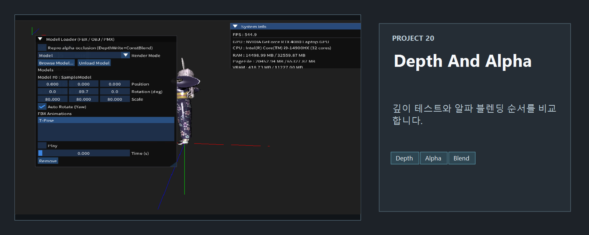
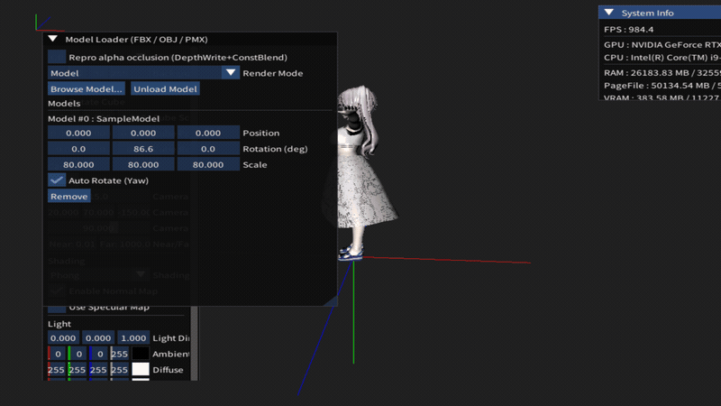

<!-- README-NAV-TOP:START -->

[이전](../19_MultiModels/README.md) | [메인](../../README.md) | [상위](../) | [다음](../21_MultiModels_With_Animations/README.md)

<!-- README-NAV-TOP:END -->

<!-- README-INFO:START -->

<!-- README-INFO:END -->

## 20. Depth Buffer and Alpha Blending artifact (20_Depth_And_Alpha_Issue)

<!-- README-BRAND:START -->

<!-- README-BRAND:END -->

- 내용 : Depth Buffer and Alpha Blending artifact가 일어나는 상황을 보여주는 예제입니다.
- 주요 구현
  1. PixelShader에서 패딩으로 투명 구간만 통과시키고 불투명은 버립니다. 깊이만 업데이트 합니다
  2. 컬러 쓰기를 끄고(블렌드 상태 m_pColorMaskNone) 렌더타겟은 건드리지 않습니다. 깊이 버퍼에만 “투명 픽셀 위치”가 가까운 값으로 채워집니다
  3. 상수버퍼를 원래로 복구하고(clip 활성), 불투명 픽셀만 색을 그립니다. 투명 구간은 본 패스에서 색을 그리지 않지만, 1번에서 이미 깊이가 앞쪽에 채워져 있으므로 뒤 오브젝트는 깊이 테스트에 실패해 그려지지 않습니다. 따라서 그 자리는 결국 배경만 보입니다

| Depth Buffer and Alpha Blending artifact |
|---|
| 

 |

- 각 1,2,3번을 주석처리해가면서 비교해보면 여러 결과를 얻을 수 있습니다

| Depth Buffer and Alpha Blending artifact | Depth Buffer and Alpha Blending artifact |
|---|---|
|  |  |

<!-- README-RUNTIME:START -->
## 실행 화면

| Screenshot | GIF |
|---|---|
|  |  |
<!-- README-RUNTIME:END -->

<!-- README-NAV-BOTTOM:START -->

[이전](../19_MultiModels/README.md) | [메인](../../README.md) | [상위](../) | [다음](../21_MultiModels_With_Animations/README.md)

<!-- README-NAV-BOTTOM:END -->
