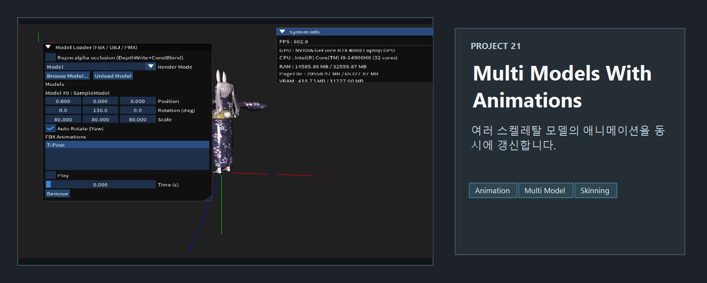
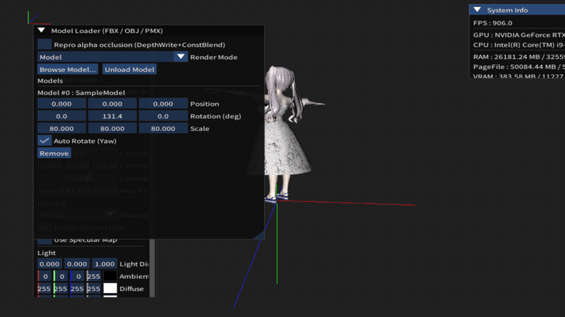

<!-- README-NAV-TOP:START -->

[이전](../20_Depth_And_Alpha_Issue/README.md) | [메인](../../README.md) | [상위](../) | [다음](../22_VMD/README.md)

<!-- README-NAV-TOP:END -->

<!-- README-INFO:START -->

<!-- README-INFO:END -->

## 21. MultiModels With Animations (21_MultiModels_With_Animations)

<!-- README-BRAND:START -->

<!-- README-BRAND:END -->

- 내용 : 여러 모델에 애니메이션을 적용한 예제입니다
- 주요 구현
  - 18번 프로젝트에서 만든 애니메이션을 벡터로 담아 실행합니다

| MultiModels With Animations |
|---|
| 

 |

<!-- README-RUNTIME:START -->
## 실행 화면

| Screenshot | GIF |
|---|---|
|  |  |
<!-- README-RUNTIME:END -->

<!-- README-NAV-BOTTOM:START -->

[이전](../20_Depth_And_Alpha_Issue/README.md) | [메인](../../README.md) | [상위](../) | [다음](../22_VMD/README.md)

<!-- README-NAV-BOTTOM:END -->
