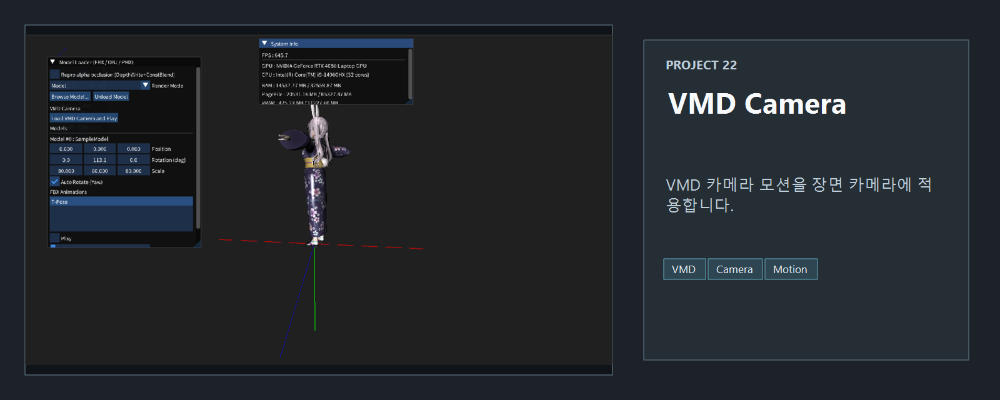
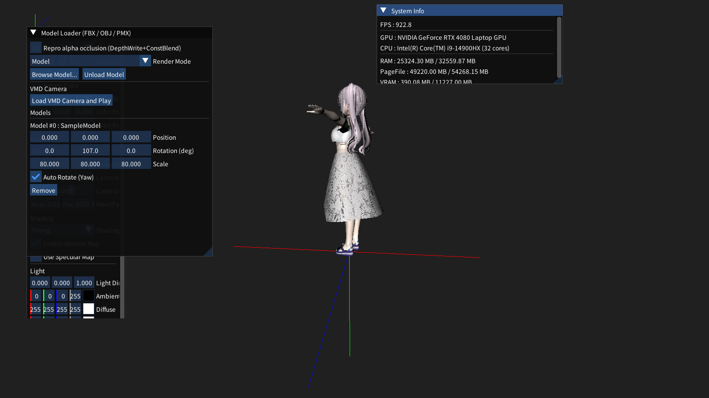
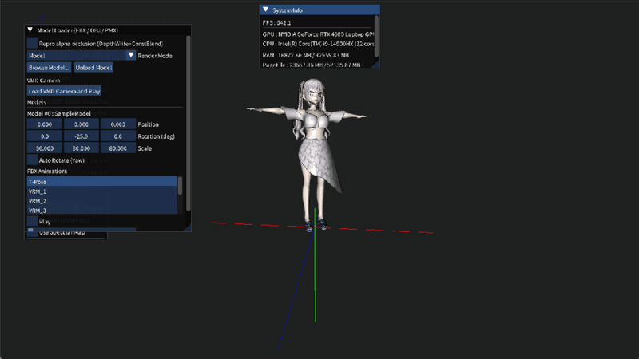

<!-- README-NAV-TOP:START -->

[이전](../21_MultiModels_With_Animations/README.md) | [메인](../../README.md) | [상위](../) | [다음](../23_Rigid_Animation/README.md)

<!-- README-NAV-TOP:END -->

<!-- README-INFO:START -->

<!-- README-INFO:END -->

# 22. VMD Camera

<!-- README-BRAND:START -->

<!-- README-BRAND:END -->

- 내용: VMD 카메라/모션 데이터를 읽어 모델과 카메라 움직임을 확인하는 프로젝트입니다.
- 주요 구현
  - MMD 계열 애니메이션 데이터 로딩
  - 카메라 트랜스폼 갱신
  - ImGui 디버그 UI를 통한 재생 상태 확인

| Screenshot |
|---|
|  |

<!-- README-RUNTIME:START -->
## 실행 화면

| Screenshot | GIF |
|---|---|
|  |  |
<!-- README-RUNTIME:END -->

<!-- README-NAV-BOTTOM:START -->

[이전](../21_MultiModels_With_Animations/README.md) | [메인](../../README.md) | [상위](../) | [다음](../23_Rigid_Animation/README.md)

<!-- README-NAV-BOTTOM:END -->
