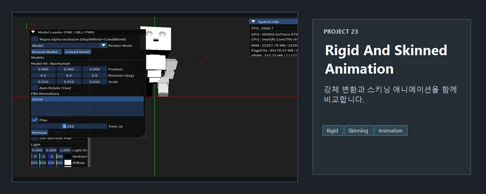
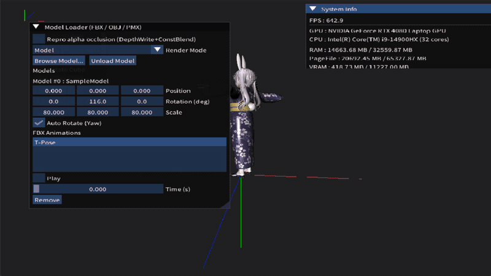

<!-- README-NAV-TOP:START -->

[이전](../22_VMD/README.md) | [메인](../../README.md) | [상위](../) | [다음](../24_Skinned_With_Bone_Structure/README.md)

<!-- README-NAV-TOP:END -->

<!-- README-INFO:START -->

<!-- README-INFO:END -->

## 23. Rigid, Skinned Animation (23_Rigid_Animation)

<!-- README-BRAND:START -->

<!-- README-BRAND:END -->

- 내용: 모델의 본과 애니메이션 유무에 따라 Static Mesh, Skinned Animation, Rigid Animation으로 분기합니다.
- 주요 구현
  - 본의 개수 == 0, 애니메이션 개수 == 0이면 Static Mesh입니다.
  - 본의 개수 > 0, 애니메이션 개수 > 0이면 Skinned Animation입니다.
  - 본의 개수 == 0, 애니메이션 개수 > 0이면 Rigid Animation입니다.
  - 본이 없고 애니메이션만 있다면 스켈레탈 노드를 사용해 리지드 노드 팔레트를 구성합니다.
  - 기본 실행 예제는 `../Resource/fbx/Study/BoxHuman.fbx`의 리지드 애니메이션을 자동 재생합니다.

| Animation - Skinned  | Animation - Rigid  |
|---|---|
| 

 | 

 |

| Animation - Static Mesh |
|---|
| 

 |

<!-- README-RUNTIME:START -->
## 실행 화면

| Screenshot | GIF |
|---|---|
|  |  |
<!-- README-RUNTIME:END -->

<!-- README-NAV-BOTTOM:START -->

[이전](../22_VMD/README.md) | [메인](../../README.md) | [상위](../) | [다음](../24_Skinned_With_Bone_Structure/README.md)

<!-- README-NAV-BOTTOM:END -->
