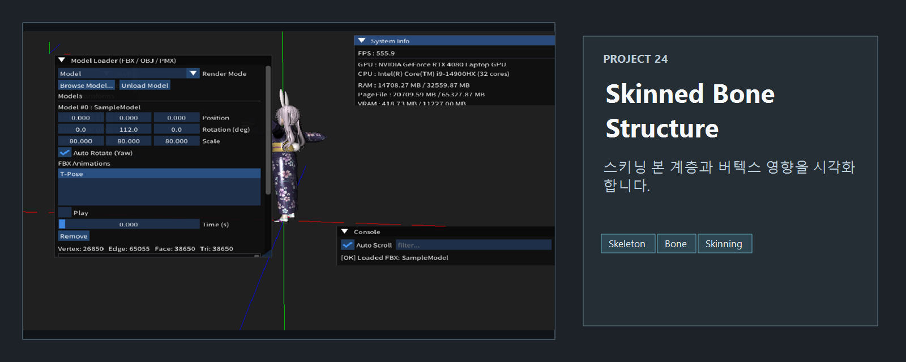
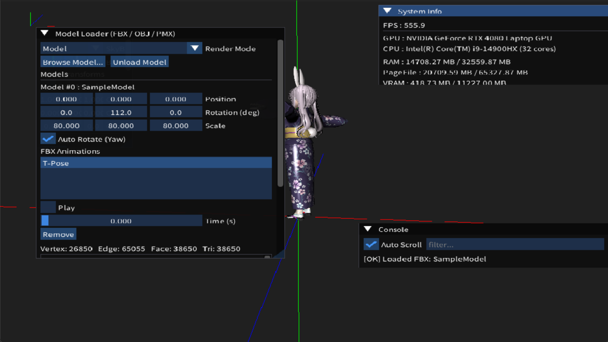
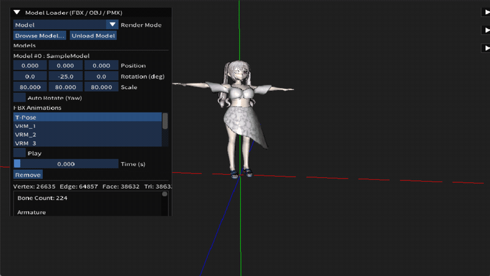

<!-- README-NAV-TOP:START -->

[이전](../23_Rigid_Animation/README.md) | [메인](../../README.md) | [상위](../) | [다음](../25_ToonShading_Outline/README.md)

<!-- README-NAV-TOP:END -->

<!-- README-INFO:START -->

<!-- README-INFO:END -->

## 24. Skinned With Bone Structure (24_Skinned_With_Bone_Structure)

<!-- README-BRAND:START -->

<!-- README-BRAND:END -->

- 내용 : Skinned 모델 본 구조를 보여주는 예제 입니다. 이전 애니메이션, rigid을 모두 포함합니다
- 주요 구현
  - 이전까지 작업했던 내용을 리팩토링했습니다
  - ImGui로 본 구조를 보여줍니다
  - 해당 모델에 대한 통계치를 계산해서 보여줍니다

| Skinned With Bone Structure |
|---|
| 

 |

<!-- README-RUNTIME:START -->
## 실행 화면

| Screenshot | GIF |
|---|---|
|  |  |
<!-- README-RUNTIME:END -->

<!-- README-NAV-BOTTOM:START -->

[이전](../23_Rigid_Animation/README.md) | [메인](../../README.md) | [상위](../) | [다음](../25_ToonShading_Outline/README.md)

<!-- README-NAV-BOTTOM:END -->
