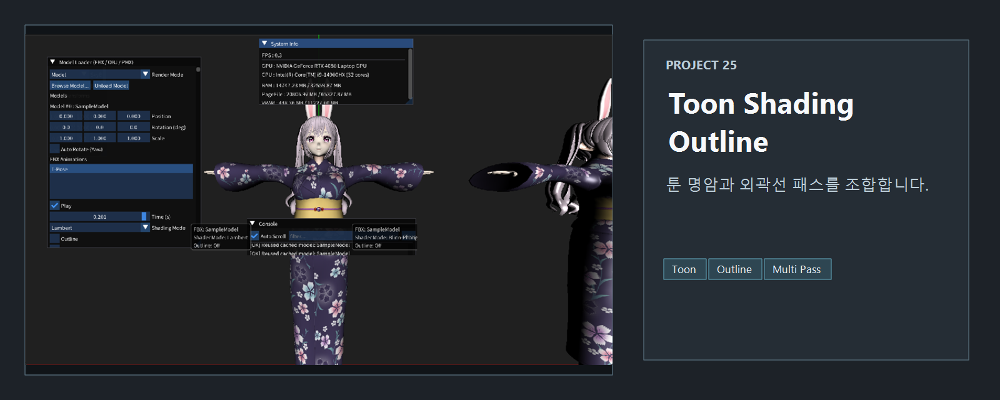
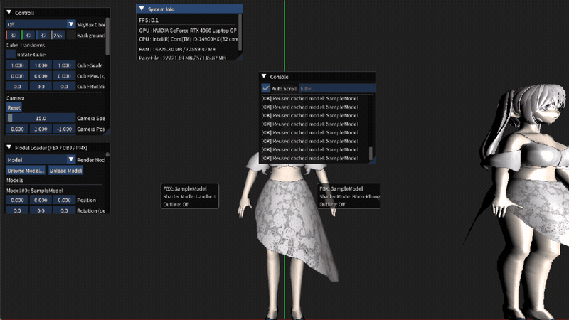

<!-- README-NAV-TOP:START -->

[이전](../24_Skinned_With_Bone_Structure/README.md) | [메인](../../README.md) | [상위](../) | [다음](../26_ShadowMap_PCF/README.md)

<!-- README-NAV-TOP:END -->

<!-- README-INFO:START -->

<!-- README-INFO:END -->

## 25. ToonShading Outline (25_ToonShading_Outline)

- 내용 : ToonShading과 Outline을 보여주는 예제입니다. 이전 쉐이더들과 한눈에 비교할 수 있게 배치했습니다.
- 주요 구현
  - Diffuse에서 Theta를 나누어서 계단식으로 그리게끔 만들었습니다.
  - Specular에서 N Dot H가 1에 가까운 구간을 강조하게 했습니다
  - 본을 그리는 패스를 렌더한 뒤, 멀티 패스에서 정점을 뷰-공간 XY로 바깥쪽으로 키웁니다.
  - 이후에 “백페이스”만 렌더합니다. 깊이는 읽기만 해서 실루엣만 남기고 앞면 색은 보이지 않게 합니다.
  - 실행이 느리면 동시에 표시하는 모델 수를 줄이고, 외곽선 패스가 추가하는 드로우 비용을 비교해 봅니다.

## 확인해 볼 것

같은 모델·조명에서 ToonShading과 외곽선 ON/OFF를 비교합니다. 아래 실행 화면은 기본 장면이며, 셰이더별 비교 이미지를 기록하려면 각 모드를 별도로 캡처해야 합니다.

<!-- README-RUNTIME:START -->
## 실행 화면

| Screenshot | GIF |
|---|---|
|  |  |
<!-- README-RUNTIME:END -->

<!-- README-NAV-BOTTOM:START -->

[이전](../24_Skinned_With_Bone_Structure/README.md) | [메인](../../README.md) | [상위](../) | [다음](../26_ShadowMap_PCF/README.md)

<!-- README-NAV-BOTTOM:END -->
