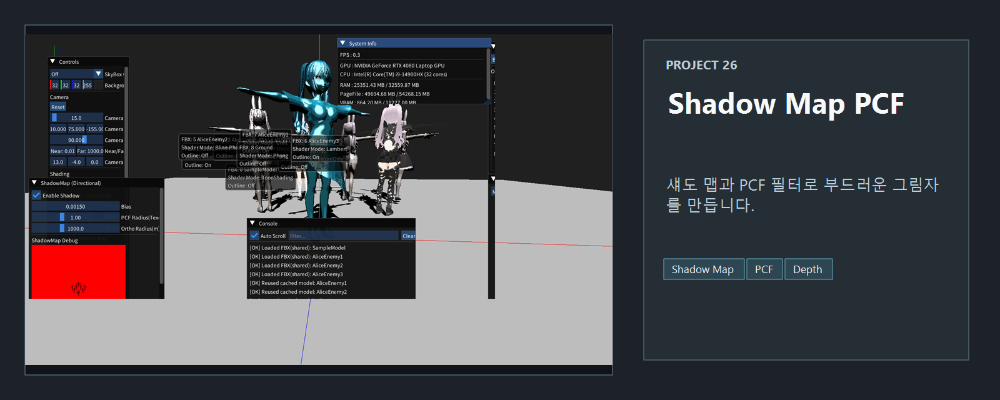
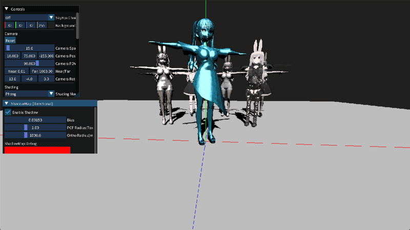

<!-- README-NAV-TOP:START -->

[이전](../25_ToonShading_Outline/README.md) | [메인](../../README.md) | [상위](../) | [다음](../27_DebugDraw/README.md)

<!-- README-NAV-TOP:END -->

<!-- README-INFO:START -->

<!-- README-INFO:END -->

## 26. ShadowMap PCF (26_ShadowMap_PCF)

- 내용: 광원에서 본 깊이와 카메라에서 본 픽셀의 깊이를 비교해 그림자를 만드는 예제입니다.
- 주요 구현
  - 깊이 텍스처에 DSV와 SRV를 만들고, 그림자 패스에서는 RTV 없이 DSV만 바인딩합니다.
  - 정점을 월드 → 광원의 뷰 → 투영 공간으로 변환해 깊이를 기록합니다.
  - 메인 패스에서 Shadow Map SRV를 `t4`, 샘플러를 `s1`에 연결합니다.
  - 픽셀의 광원 공간 좌표를 Shadow Map UV·깊이로 변환해 저장된 깊이와 비교합니다.
  - PCF는 주변 깊이 비교 결과를 평균해 그림자 경계를 부드럽게 만듭니다.

## 확인해 볼 것

그림자가 반대로 나오거나 어긋나면 광원 방향의 부호, 광원 뷰·투영 행렬, perspective divide, NDC에서 텍스처 UV로 바꿀 때의 Y 방향을 함께 확인합니다. 모델 원점을 바꾸는 것만으로 해결되는 문제는 아닙니다.

같은 장면에서 bias와 PCF 반경을 바꿔 보세요. bias가 너무 작으면 자기 그림자 줄무늬가, 너무 크면 물체에서 떨어진 그림자가 생길 수 있습니다. 아래 캡처는 현재 실행 화면 한 종류입니다.

<!-- README-RUNTIME:START -->
## 실행 화면

| Screenshot | GIF |
|---|---|
|  |  |
<!-- README-RUNTIME:END -->

<!-- README-NAV-BOTTOM:START -->

[이전](../25_ToonShading_Outline/README.md) | [메인](../../README.md) | [상위](../) | [다음](../27_DebugDraw/README.md)

<!-- README-NAV-BOTTOM:END -->
