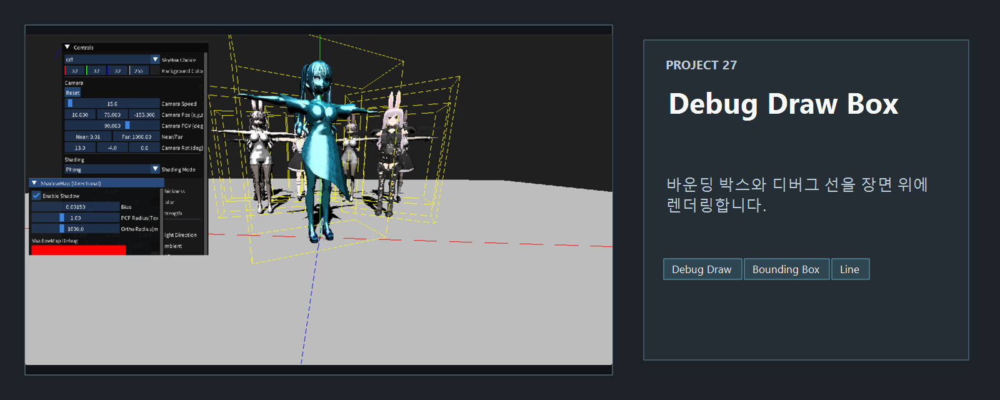
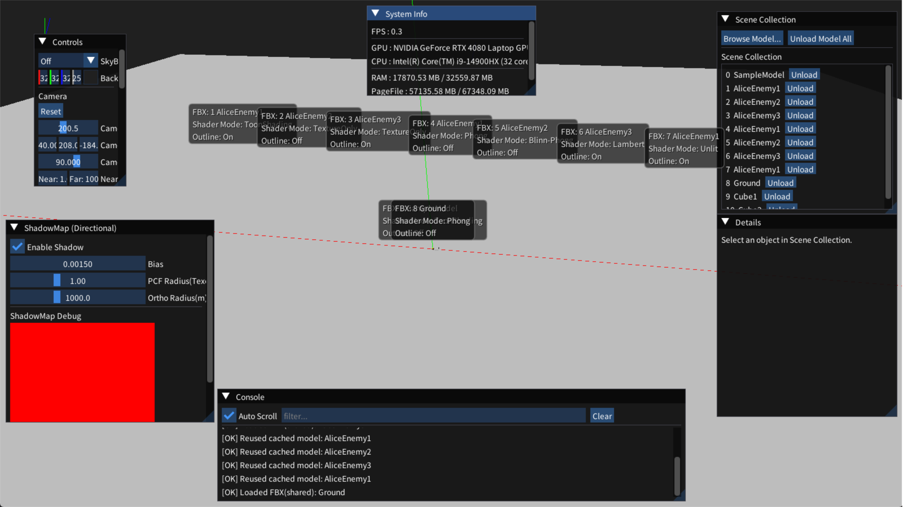
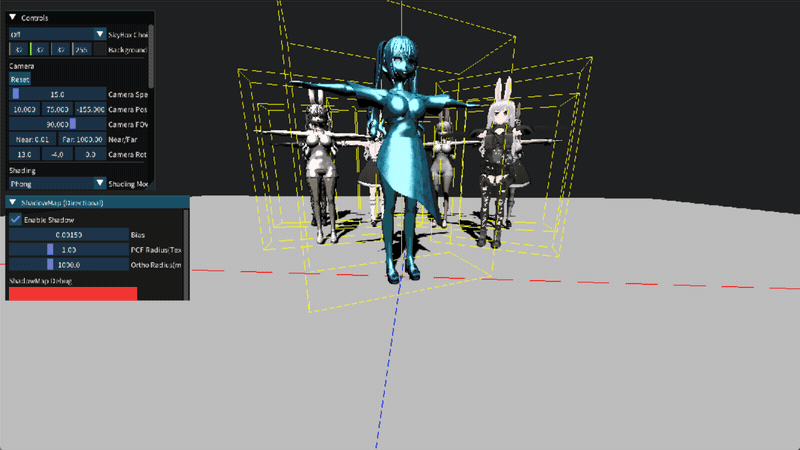

<!-- README-NAV-TOP:START -->

[이전](../26_ShadowMap_PCF/README.md) | [메인](../../README.md) | [상위](../) | [다음](../28_Scene_Shared3DModel_Animation/README.md)

<!-- README-NAV-TOP:END -->

<!-- README-INFO:START -->

<!-- README-INFO:END -->

## 27. debug draw box (27_DebugDraw)

<!-- README-BRAND:START -->

<!-- README-BRAND:END -->

- 내용 : AABB Bounding Box를 그린 예제입니다
- 주요 구현
  - 3D 메시를 처음 로드할때 AABB의 Min Vector, Max Vector를 저장해둡니다
  - 각 메시 오브젝트에 저장된 AABB Bound box를 렌더합니다
  - 렌더할때 어떤 본을 기준으로 렌더할지 선택할 수 있게 합니다
  - 선을 그리는 거는 기존에 만들어둔 LineRenderer를 사용합니다
  - LineRenderer용 Vertex Shader에서 본 팔레트만 적용하여 디버그 박스를 그릴 수 있게 합니다. 이렇게 해야 선택된 본의 애니메이션을 라인 박스가 즉시 따라갑니다. GPU에게 본 계산을 시키자는 이야기 입니다
  
- 변경 내용
  - 기존 렌더 모드로 나누던 것에서 큐브, 3D mesh 모두 패널에서 조작 가능하게 리팩토링 했습니다
  - 렌더 파이프라인을 전체적으로 리팩토링 했습니다. 이제 그리려는 오브젝트만 그립니다 
  
| 디버그 박스 |
|---|
| 

 |

<!-- README-RUNTIME:START -->
## 실행 화면

| Screenshot | GIF |
|---|---|
|  |  |
<!-- README-RUNTIME:END -->

<!-- README-NAV-BOTTOM:START -->

[이전](../26_ShadowMap_PCF/README.md) | [메인](../../README.md) | [상위](../) | [다음](../28_Scene_Shared3DModel_Animation/README.md)

<!-- README-NAV-BOTTOM:END -->
