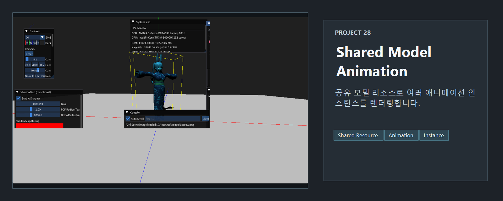
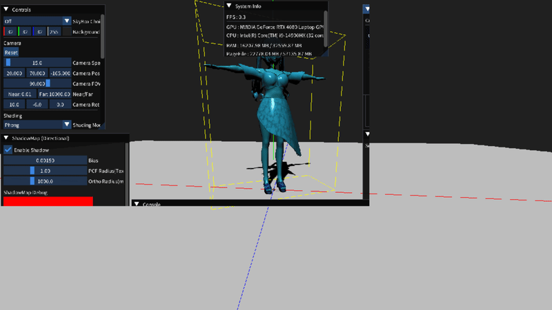

<!-- README-NAV-TOP:START -->

[이전](../27_DebugDraw/README.md) | [메인](../../README.md) | [상위](../) | [다음](../29_MousePicking/README.md)

<!-- README-NAV-TOP:END -->

<!-- README-INFO:START -->

<!-- README-INFO:END -->

## 28.  scene shared3d model

<!-- README-BRAND:START -->
<!-- README-BRAND:END -->

- 내용 : 애셋 매니저를 만든 예제입니다
- 주요 구현
  - fbx 데이터를 로드할때 에셋 매니저에서 캐시 데이터가 있는지 확인합니다.
  - 만약 있다면 shared_ptr, weak_ptr 구조로 데이터를 반환합니다.
  - 캐시를 저장할때는 두 가지 방법 중 하나를 선택해야합니다.
  - 모델을 계속해서 로드해도 VRAM이 증가하지 않습니다. 즉 데이터를 공유합니다.
  - 1. 경로 기반 키
  - 2. 데이터 기반 키
  - 현재 코드는 데이터 기반 키로 되어 있으며 FBX 파일만을 캐시하고 있습니다
  - 또한 씬 전환 후에 IDXGIDevice3::Trim() 함수로  드라이버에게 VRAM/DRAM/pagefile.sys에서 리소스 제거를 요청합니다
  
| 여러 모델, 애니메이션 |
|---|
| 

 |

| 씬 B | 씬 A |
|---|---|
| 

 | 

 |

<!-- README-RUNTIME:START -->
## 실행 화면

| Screenshot | GIF |
|---|---|
|  |  |
<!-- README-RUNTIME:END -->

<!-- README-NAV-BOTTOM:START -->

[이전](../27_DebugDraw/README.md) | [메인](../../README.md) | [상위](../) | [다음](../29_MousePicking/README.md)

<!-- README-NAV-BOTTOM:END -->
