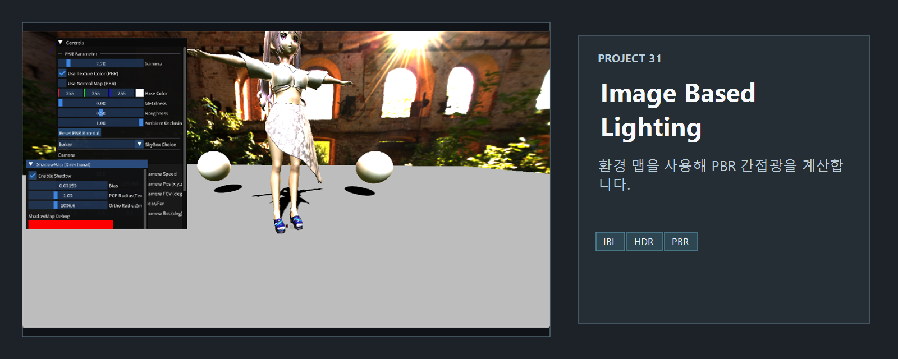
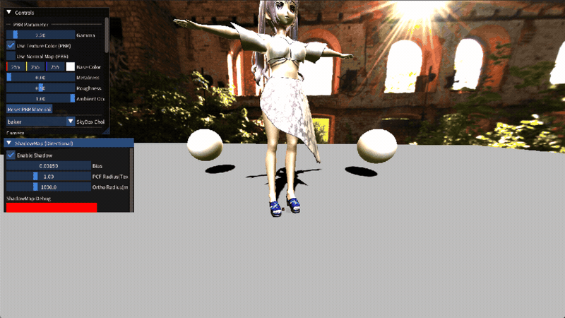

<!-- README-NAV-TOP:START -->

[이전](../30_PBR_BRDF/README.md) | [메인](../../README.md) | [상위](../) | [다음](../32_Sound_FMOD/README.md)

<!-- README-NAV-TOP:END -->

<!-- README-INFO:START -->

<!-- README-INFO:END -->

# 31. IBL (Image Based Lighting)

| IBL |
|----|
| 
 metalic 1.0, roughness 0.0
 |

| IBL |
|----|
| 
 metalic 1.0, roughness 0.18
 |

| IBL |
|----|
| 
 metalic 0.77, roughness 0.38
 |

### IBL을 왜 쓰는가
- 그냥 ambient 색만 더하면 어디서 빛이 오는지 정보가 없어서, 환경(벽·하늘·숲)의 색이 물체에 안 비칩니다.
- IBL(Image‑Based Lighting) 은 HDR 스카이박스 한 장을 빛의 지도로 텍스처를 만들어서 쓰는 방법이라, 다른 조명 세팅을 하지 않아도 환경색·반사가 자동으로 맞게 나옵니다.

### Diffuse IBL
- Diffuse 를 법선 N 방향으로 한 번 샘플해서 주변에서 퍼지는 빛을 근사합니다 금속은 난반사가 거의 없으므로 PBR과 동일하게 kD(1‑F, 1‑metalness)를 곱해서 줄입니다.
### Specular IBL
- 거칠기별로 미리 블러된 큐브맵(g_IBL_Specular)과 BRDF LUT를 사용해 환경 반사를 계산합니다.
- Renv = reflect(-V, N) 방향으로 스펙큘러 큐브맵을, (N·V, roughness)로 LUT를 샘플해서 거칠기·시야각에 맞는 반사 강도만 빠르게 가져옵니다.
### AO + 추가 ambient
- IBL은 열린 공간 기준이라, AO로 구석/접촉면의 환경광을 줄이고 그림자를 표현합니다
- 너무 어두워지는 것을 막기 위해, 기존 DirLight.ambient 를 아주 작은 비율(0.1) 로만 더해 기본 밝기를 살짝 올립니다.

<!-- README-RUNTIME:START -->
## 실행 화면

| Screenshot | GIF |
|---|---|
|  |  |
<!-- README-RUNTIME:END -->

<!-- README-NAV-BOTTOM:START -->

[이전](../30_PBR_BRDF/README.md) | [메인](../../README.md) | [상위](../) | [다음](../32_Sound_FMOD/README.md)

<!-- README-NAV-BOTTOM:END -->
