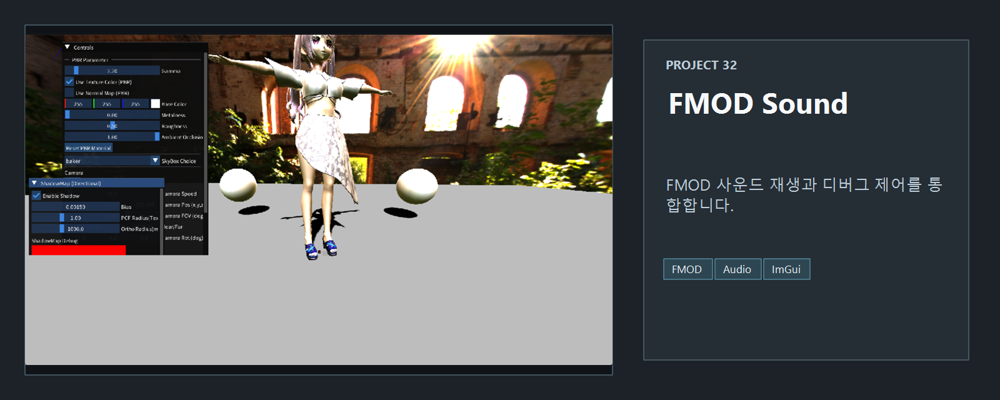
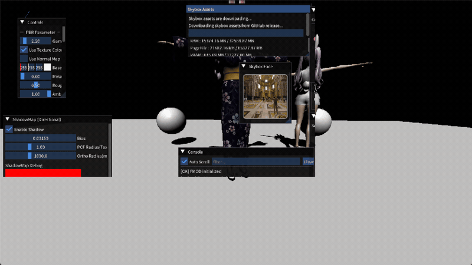

<!-- README-NAV-TOP:START -->
<div align="center">

[이전](../31_IBL/README.md) | [메인](../../README.md) | [상위](../) | [다음](../33_Sound_Animation_Camera_Motion/README.md)

</div>
<!-- README-NAV-TOP:END -->

<!-- README-INFO:START -->
<p align="center"></p>
<!-- README-INFO:END -->

### 32. FMOD + 애니메이션 동기화

## Screenshot

| README capture |
|---|
|  |

- 목적 
  - 이후 시네마틱 카메라 연출과 애니메이션과 사운드를 하나로 통합하기 위함
- 작업내용
  - FMOD로 노래를 재생하고, FBX 애니메이션 타임라인(초 단위) 과 사운드 재생 위치를 1:1로 맞춘다.  
  - 타임슬라이더를 움직이면, 해당 위치의 애니메이션과 노래가 동시에 이동한다.
  

---

### 1. 준비

- FMOD SDK 위치
  - 헤더: `third_party/FMOD/inc`  
  - 라이브러리: `third_party/FMOD/x64`
- 프로젝트 설정 (32_Sound_FMOD만)
  - C/C++ → 추가 포함 디렉터리: `third_party/FMOD/inc`  
  - Linker → 추가 라이브러리 디렉터리: `third_party/FMOD/x64`  
  - `SoundManager.h / SoundManager.cpp` 파일을 프로젝트에 추가

---

### 2. 사용 패턴

- 앱 수명주기에서 FMOD 연결

```cpp
// 초기화
Sound::Initialize();

// 종료
Sound::Shutdown();

// 매 프레임
Sound::Update();
```

- **노래 로드 + 기본 컨트롤 (ImGui)**

```cpp
// 파일 열기 → Sound::LoadMusic(path);
// 이후 버튼으로 제어
Sound::Play();
Sound::Pause(true);
Sound::Stop();
Sound::SetTimeSeconds(timeSec);   // 슬라이더 값(초) 그대로 전달
```

---

### 3. 애니메이션과 동기화

- FBX 애니메이션 시간(초)을 그대로 FMOD에 전달

```cpp
float cur = /* 애니메이션 현재 시간(초) */;
float dur = /* 애니메이션 전체 길이(초) */;

ImGui::SliderFloat("Time (s)", &cur, 0.0f, dur);
mdl.animator.SetTimeSec(cur);     // 애니메이션 이동
Sound::SetTimeSeconds(cur);       // 사운드도 같은 초로 이동
```

- Play 토글 시 애니 + 사운드 함께 제어

```cpp
bool play = /* 체크박스 값 */;
mdl.animator.SetPlaying(play);
if (play) Sound::Play();
else      Sound::Pause(true);
```

<!-- README-RUNTIME:START -->
## 실행 화면

| Screenshot | GIF |
|---|---|
|  |  |
<!-- README-RUNTIME:END -->

<!-- README-NAV-BOTTOM:START -->
<div align="center">

[이전](../31_IBL/README.md) | [메인](../../README.md) | [상위](../) | [다음](../33_Sound_Animation_Camera_Motion/README.md)

</div>
<!-- README-NAV-BOTTOM:END -->
