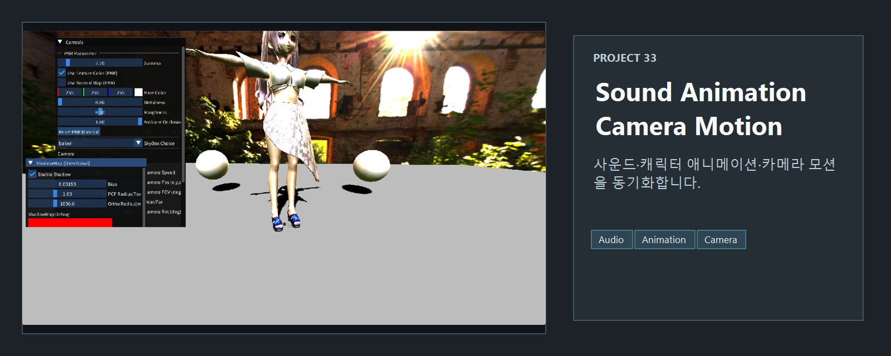
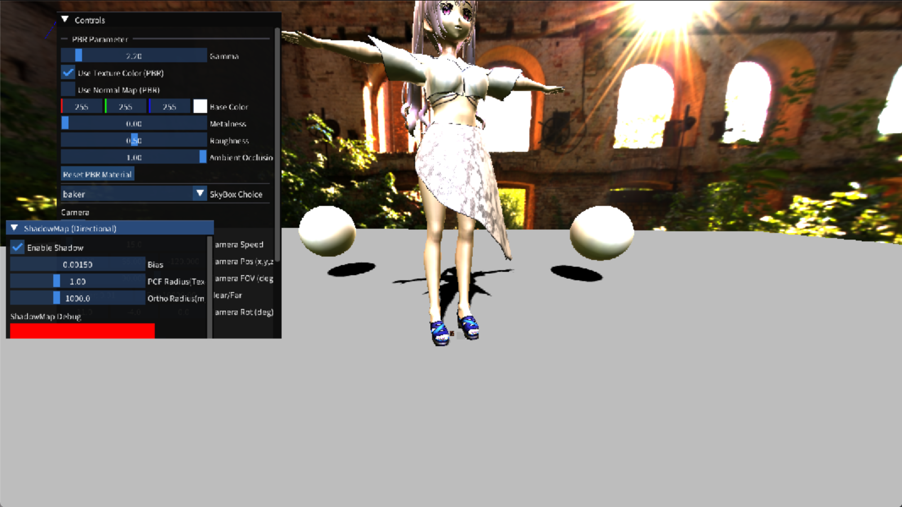
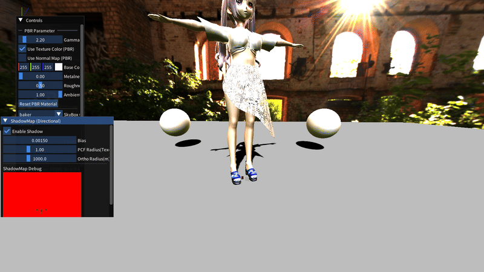

<!-- README-NAV-TOP:START -->

[이전](../32_Sound_FMOD/README.md) | [메인](../../README.md) | [상위](../) | [다음](../34_ToneMapping/README.md)

<!-- README-NAV-TOP:END -->

<!-- README-INFO:START -->

<!-- README-INFO:END -->

# 33. Sound Animation Camera Motion

<!-- README-BRAND:START -->
<!-- README-BRAND:END -->

- 내용: 사운드, 애니메이션, 카메라 모션을 함께 확인하는 프로젝트입니다.
- 주요 구현
  - 캐릭터 애니메이션 재생
  - FMOD 사운드 연동
  - 카메라 모션 및 디버그 UI 확인

| Screenshot |
|---|
|  |

<!-- README-RUNTIME:START -->
## 실행 화면

| Screenshot | GIF |
|---|---|
|  |  |
<!-- README-RUNTIME:END -->

<!-- README-NAV-BOTTOM:START -->

[이전](../32_Sound_FMOD/README.md) | [메인](../../README.md) | [상위](../) | [다음](../34_ToneMapping/README.md)

<!-- README-NAV-BOTTOM:END -->
