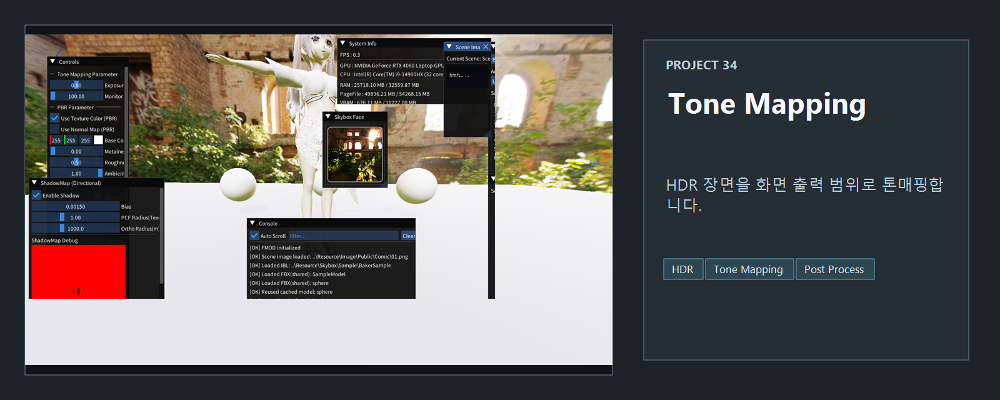
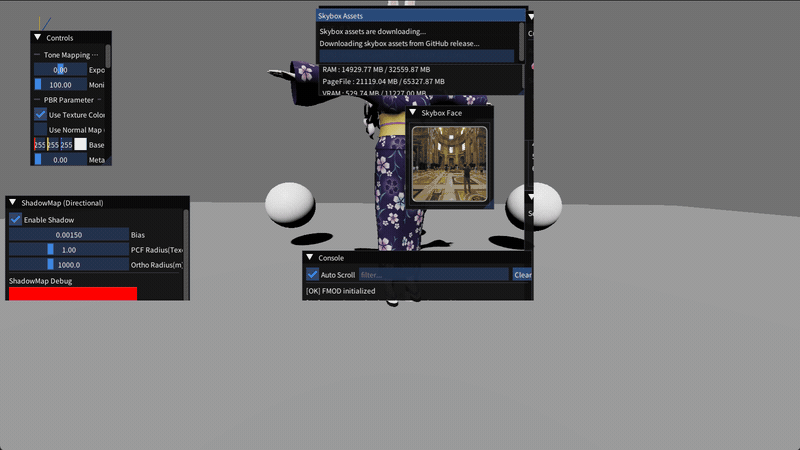

<!-- README-NAV-TOP:START -->

[이전](../33_Sound_Animation_Camera_Motion/README.md) | [메인](../../README.md) | [상위](../) | [다음](../35_DeferredRendering/README.md)

<!-- README-NAV-TOP:END -->

<!-- README-INFO:START -->

<!-- README-INFO:END -->

# 34. Tone Mapping

<!-- README-BRAND:START -->
<!-- README-BRAND:END -->

- 내용: HDR 렌더링 결과에 톤매핑을 적용하는 프로젝트입니다.
- 주요 구현
  - PBR/IBL 장면 렌더링
  - 톤매핑 파라미터 조정
  - 캐릭터와 테스트 오브젝트를 같은 장면에서 확인

| Screenshot |
|---|
|  |

<!-- README-RUNTIME:START -->
## 실행 화면

| Screenshot | GIF |
|---|---|
|  |  |
<!-- README-RUNTIME:END -->

<!-- README-NAV-BOTTOM:START -->

[이전](../33_Sound_Animation_Camera_Motion/README.md) | [메인](../../README.md) | [상위](../) | [다음](../35_DeferredRendering/README.md)

<!-- README-NAV-BOTTOM:END -->
