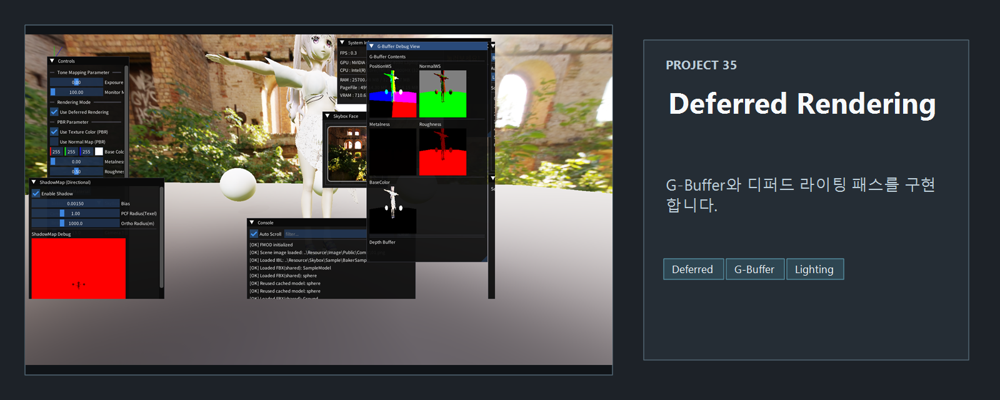
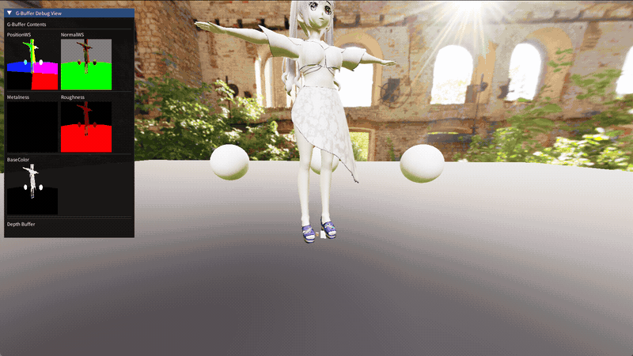

<!-- README-NAV-TOP:START -->
<div align="center">

[이전](../34_ToneMapping/README.md) | [메인](../../README.md) | [상위](../) | [다음](../36_AdvancedAnim_Sound_Click/README.md)

</div>
<!-- README-NAV-TOP:END -->

<!-- README-INFO:START -->
<p align="center"></p>
<!-- README-INFO:END -->

# 35. Deferred Rendering

## Screenshot

| README capture |
|---|
|  |

이 예제는 Forward Rendering으로 그리던 장면을 G-Buffer 기반 Deferred Rendering 구조로 확장한 단계입니다. 목적은 "많은 조명을 한 번에 다루기 위해 렌더링을 지오메트리 패스와 라이팅 패스로 나눈다"는 핵심 흐름을 직접 확인하는 것입니다.

## 핵심 구현

- Geometry Pass: 모델의 위치, 노멀, 재질 정보를 여러 렌더 타겟에 기록합니다.
- Lighting Pass: 전체화면 Quad에서 G-Buffer를 읽어 조명을 계산합니다.
- Debug View: ImGui에서 G-Buffer를 확인해 어떤 값이 저장되는지 점검합니다.
- Tone Mapping: HDR 결과를 LDR/HDR 출력에 맞게 변환합니다.

## G-Buffer 구성

| 버퍼 | 내용 | 용도 |
|---|---|---|
| Position | 월드 공간 위치 | 조명 벡터, 감쇠 계산 |
| Normal | 월드 공간 노멀 | 난반사/정반사 계산 |
| Material | 금속성, 거칠기 등 | PBR 파라미터 |
| Albedo | 기본 색상 | 최종 조명 색상 |

## 렌더 흐름

```text
PassClear
 -> PassShadow
 -> PassGBuffer
 -> PassDeferredLight
 -> PassPostProcess
 -> PassUI
```

## 주요 파일

- `App.cpp`: 렌더 패스 구성과 G-Buffer 생성
- `35_DeferredGBufferVS.hlsl`, `35_DeferredGBufferPS.hlsl`: 지오메트리 패스
- `35_DeferredLightPS.hlsl`: 라이팅 패스
- `35_DeferredShared.fxh`: G-Buffer 공유 구조
- `35_ToneMappingPS_HDR.hlsl`, `35_ToneMappingPS_LDR.hlsl`: 톤매핑

## 포트폴리오에서 볼 포인트

- Forward와 Deferred의 패스 분리
- MRT(Multiple Render Targets) 사용
- 디버그 UI로 렌더 타겟 내용을 검증하는 흐름
- 36번 예제에서 애니메이션, 사운드, UI와 결합되기 전의 순수 Deferred Rendering 단계

<!-- README-RUNTIME:START -->
## 실행 화면

| Screenshot | GIF |
|---|---|
|  |  |
<!-- README-RUNTIME:END -->

<!-- README-NAV-BOTTOM:START -->
<div align="center">

[이전](../34_ToneMapping/README.md) | [메인](../../README.md) | [상위](../) | [다음](../36_AdvancedAnim_Sound_Click/README.md)

</div>
<!-- README-NAV-BOTTOM:END -->
