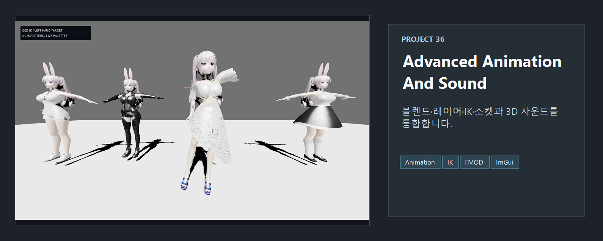

<!-- README-NAV-TOP:START -->

[이전](../35_DeferredRendering/README.md) | [메인](../../README.md) | [상위](../) | [다음](../37_Blueprint/README.md)

<!-- README-NAV-TOP:END -->

<!-- README-INFO:START -->

<!-- README-INFO:END -->

# 36. Animation, FMOD 3D Sound, Multithread

<!-- README-BRAND:START -->
<!-- README-BRAND:END -->

이 이후의 애니메이션 구현은 다음의 레포에서 계속됩니다.

https://github.com/Chang-Jin-Lee/D3D11-AliceAnimation

## 애니메이션

- Animation Blend
- Additive
- Animation Layer
- IK
- Socket

| Screenshot | GIF |
|---|---|
|  |  |

## 구현 내용

- 공개 배포 가능한 VRoid 캐릭터 모델을 사용합니다.
- 외부 FBX 애니메이션 클립을 glTF/glb 캐릭터의 스켈레톤 이름에 매칭합니다.
- Unreal 기준 FBX 위치 키를 glTF/glb 기준 미터/Y-up 좌표계로 변환해 루트/골반 트랜스폼이 튀지 않게 보정합니다.
- FMOD 3D 사운드, ImGui 디버그 패널, 멀티스레드 리소스 로딩을 함께 확인할 수 있습니다.

<!-- README-RUNTIME:START -->
## 실행 화면

| Screenshot | GIF |
|---|---|
|  |  |
<!-- README-RUNTIME:END -->

<!-- README-NAV-BOTTOM:START -->

[이전](../35_DeferredRendering/README.md) | [메인](../../README.md) | [상위](../) | [다음](../37_Blueprint/README.md)

<!-- README-NAV-BOTTOM:END -->
