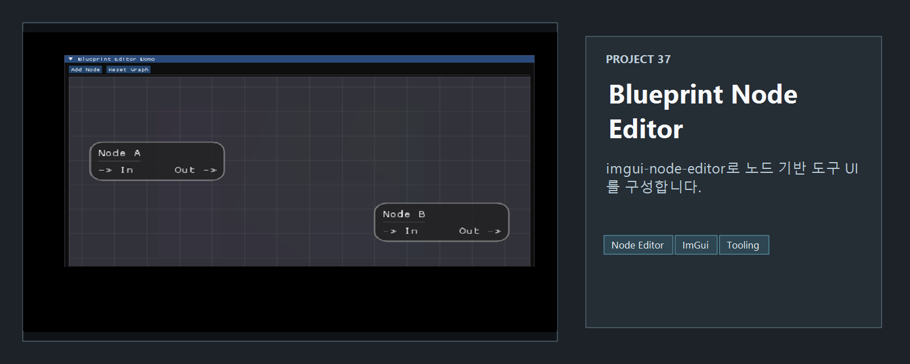
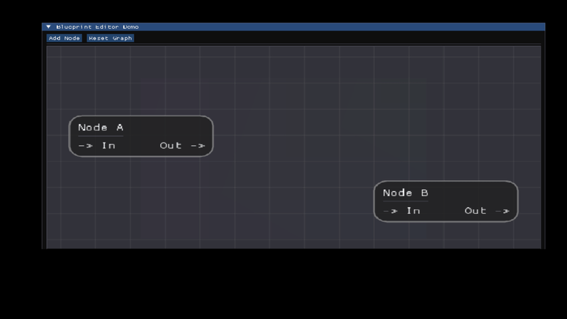

<!-- README-NAV-TOP:START -->

[이전](../36_AdvancedAnim_Sound_Click/README.md) | [메인](../../README.md) | [상위](../) | 다음

<!-- README-NAV-TOP:END -->

<!-- README-INFO:START -->

<!-- README-INFO:END -->

# 37. Blueprint

- 내용: imgui-node-editor를 사용해 노드 기반 UI를 실험하는 프로젝트입니다.
- 주요 구현
  - 노드 에디터 샘플 실행
  - ImGui 기반 툴 UI 구성
  - 그래픽스 튜토리얼 이후 도구형 UI 확장 실험

| Screenshot |
|---|
|  |

<!-- README-RUNTIME:START -->
## 실행 화면

| Screenshot | GIF |
|---|---|
|  |  |
<!-- README-RUNTIME:END -->

<!-- README-NAV-BOTTOM:START -->

[이전](../36_AdvancedAnim_Sound_Click/README.md) | [메인](../../README.md) | [상위](../) | 다음

<!-- README-NAV-BOTTOM:END -->
