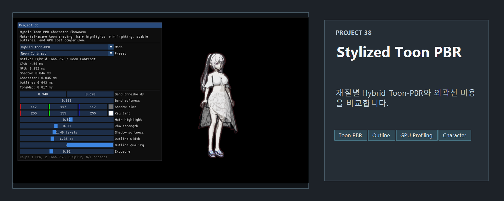
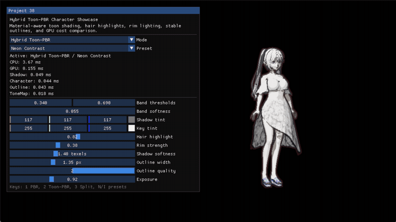

<!-- README-NAV-TOP:START -->

[이전](../37_Blueprint/README.md) | [메인](../../README.md) | [상위](../) | 다음

<!-- README-NAV-TOP:END -->

<!-- README-INFO:START -->

<!-- README-INFO:END -->

# 38. Stylized Toon PBR

공개 `SampleModel.glb` 한 캐릭터를 같은 카메라·포즈·조명 조건에서 비교하는 Direct3D 11 스타일라이즈드 렌더링 쇼케이스입니다. 물리 기반 입력을 유지하면서 명암 면, 머리카락 하이라이트, 림 라이트, 외곽선을 아트 디렉션할 수 있도록 구성했습니다.

특정 작품의 셰이더 값, UI, 이름, 로고, 텍스처를 모사하지 않습니다. 프리미엄 애니메이션 게임의 넓은 시각 언어에서 영감을 얻되, 이 프로젝트의 두 프리셋과 셰이딩 파라미터는 독자적으로 설계했습니다.

## 비교 모드와 프리셋

| 항목 | 동작 |
|---|---|
| `PBR` | 베이스 컬러, 금속성, 거칠기와 직접광을 사용하는 기준 렌더링입니다. |
| `Hybrid Toon-PBR` | PBR 입력 위에 3영역 확산 램프, 재질별 스페큘러, 헤어 밴드, 림 라이트를 적용합니다. |
| `Split` | 왼쪽 `PBR`, 오른쪽 `Hybrid Toon-PBR`을 같은 프레임의 같은 카메라·포즈·조명·노출로 그립니다. 셰이딩 경로만 달라집니다. |
| `Neon Contrast` | 차가운 그림자와 따뜻한 키 라이트의 분리를 강하게 하고 가장자리 강조를 밝게 만듭니다. |
| `Industrial Soft` | 채도와 하이라이트를 절제하고 밴드 전이를 더 부드럽게 만듭니다. |

## 구현된 렌더링 경로

1. `Shadow Map` 패스가 현재 스키닝 포즈를 깊이 맵에 기록합니다. 알파 마스크와 양면 재질도 가시 패스와 같은 재질 규칙을 사용합니다.
2. 캐릭터 패스가 HDR 색상과 월드 노멀/재질 프로필을 MRT에 기록합니다. `PBR`과 `Hybrid Toon-PBR`은 렌더 타깃, 조명, 노출을 공유합니다.
3. `Normal/Depth` 외곽선 패스가 복원한 뷰 깊이와 월드 노멀 불연속을 함께 검사합니다. 해상도 역수를 사용해 픽셀 폭을 유지하고, 배경끼리의 깊이 차이는 제외하며, 순수 검정 대신 Skin/Hair/Cloth 프로필별 어두운 색을 합성합니다.
4. `Tone Mapping` 패스가 선택한 프리셋, 노출, 외곽선 마스크를 합성합니다. 색이 있는 하이라이트를 흰색으로 잘라내지 않고 선형 색을 sRGB 출력으로 변환합니다.
5. 작은 HUD가 현재 모드, 프리셋, CPU 프레임 간격과 GPU 패스 시간을 표시합니다.

### 재질별 Hybrid Toon-PBR

- `Skin`은 피부 톤을 보존하는 부드러운 스페큘러와 따뜻한 키 응답을 사용합니다.
- `Hair`는 좁은 밴드 하이라이트와 짙은 재질 인지 외곽선을 사용합니다.
- `Cloth`는 넓고 조용한 스페큘러로 광택을 억제합니다.
- `SampleModel`의 재질 인덱스에는 프로젝트 내부의 명시적 프로필 오버라이드를 적용하고, 다른 재질 이름에는 `hair`, `face`/`skin`, `cloth`/`body` 분류를 폴백으로 사용합니다.
- 확산광은 `Band thresholds`와 `Band softness`로 제어하는 3영역 램프입니다. 중립 `Shadow tint`와 순백색 `Key tint`는 베이스 텍스처를 덮어쓰지 않고 곱해집니다.
- 림 항은 시선 의존 항에 광원 방향 항을 함께 제한해 실루엣 전체가 평평하게 빛나는 현상을 줄입니다.

## 조작

| 입력 / HUD 컨트롤 | 기능 |
|---|---|
| `1` / `Mode: PBR` | 기준 PBR 모드 |
| `2` / `Mode: Hybrid Toon-PBR` | 스타일라이즈드 모드 |
| `3` / `Mode: Split` | 같은 화면 좌우 비교 |
| `N` / `Preset: Neon Contrast` | 강한 웜/쿨 대비 프리셋 |
| `I` / `Preset: Industrial Soft` | 부드럽고 절제된 프리셋 |
| `Band thresholds` | 어두운 면, 중간 면, 밝은 면의 경계 |
| `Band softness` | 각 확산 밴드 경계의 전이 폭 |
| `Shadow tint` | 그림자 영역의 색 |
| `Key tint` | 직접광 영역의 색 |
| `Hair highlight` | 머리카락 밴드 하이라이트 강도 |
| `Rim strength` | 광원 방향으로 제한된 림 라이트 강도 |
| `Shadow softness` | Shadow Map PCF 샘플 간격 |
| `Outline width` | 화면 공간 외곽선의 픽셀 폭 |
| `Outline quality` | 외곽선 샘플 품질 `1` 또는 `2` |
| `Exposure` | 두 비교 경로가 공유하는 HDR 노출 |

프리셋을 다시 선택하면 관련 조명·밴드 파라미터가 해당 프리셋의 시작값으로 돌아갑니다. README 캡처 모드에서는 애니메이션 시간을 고정해 정면 3/4 구도가 회전하지 않으며, 일반 실행에서는 내장 Idle 애니메이션이 계속 재생됩니다.

## 선택 기능과 실패 상태

- 모델이 없거나 핵심 캐릭터 셰이더를 컴파일하지 못하면 초기화를 명확한 오류로 중단합니다. 빈 화면을 성공처럼 표시하지 않습니다.
- 노멀/깊이 외곽선 리소스만 만들지 못한 경우 캐릭터와 Tone Mapping은 계속 실행됩니다. HUD에는 `Outlines disabled: optional normal/depth edge pipeline unavailable`이 표시됩니다.
- GPU 쿼리가 아직 준비되지 않았으면 `GPU: warming up`, 프로파일러를 만들 수 없으면 `GPU: unavailable`을 표시합니다. 어느 상태에서도 현재 프레임이 결과를 기다리며 멈추지 않습니다.

## 최적화: 구현 근거와 해석

### 실행 코드에서 확인되는 측정 근거

- 셰이더, 샘플러, 래스터라이저/블렌드/깊이 상태는 초기화 때 만들고 재사용합니다. HDR, Normal/Depth, 외곽선, Shadow Map 렌더 타깃도 창 크기가 바뀌기 전까지 재사용합니다.
- 자주 읽는 캐릭터/포스트 파라미터는 `alignas(16)` 상수 버퍼로 묶습니다. 재질 이름 분류는 로딩 시 수행하고, 픽셀 셰이더에는 숫자형 Skin/Hair/Cloth 프로필을 전달합니다.
- GPU 측정은 `Shadow`, `Character`, `Outline`, `ToneMap`의 시작/끝 타임스탬프와 disjoint 쿼리를 묶은 **4-slot ring**을 사용합니다. `EndFrame`이 쓰기 헤드를 다음 슬롯으로 전진시킨 뒤 `Resolve`가 실행되므로, `kResolveDelay = 2`는 다가올 쓰기 헤드에서 두 슬롯 뒤이면서 방금 완료한 프레임 기준 한 프레임 전인 완성 샘플을 선택합니다. 슬롯 거리와 완료 프레임 나이는 서로 다릅니다.
- 결과 조회는 `D3D11_ASYNC_GETDATA_DONOTFLUSH`로 한 번씩만 시도합니다. 준비되지 않은 쿼리는 반복 대기하지 않고 직전의 완전한 결과를 유지합니다.
- HUD의 GPU 합계는 위 네 패스의 측정값 합이며, 각 패스 값도 따로 표시합니다. `Outline quality` 두 단계는 같은 장면에서 외곽선 비용 차이를 직접 비교할 수 있게 합니다.

### 측정값 해석과 일반 조언

- README에는 특정 GPU의 고정 벤치마크 수치를 제시하지 않습니다. 실제 값은 드라이버, 해상도, 빌드 설정과 실행 환경에 따라 달라지므로 HUD가 `warming up`을 벗어난 뒤 동일 모드·프리셋·구도에서 여러 프레임을 비교하십시오.
- `Split`은 시각적 A/B 비교에 적합하지만 캐릭터를 좌우로 각각 그리므로 단일 `PBR` 또는 `Hybrid Toon-PBR` 모드와 드로우 비용이 동일하지 않습니다.
- GPU 합계는 이 튜토리얼이 감싼 네 렌더 패스의 합입니다. ImGui HUD, Present, 드라이버 대기까지 포함한 전체 애플리케이션 비용으로 해석하지 마십시오. CPU 표시는 별도의 실제 프레임 간격입니다.
- 프로젝트를 확장한다면 변경이 드문 상수 버퍼에 dirty flag를 두고, 동일 해상도의 타깃 풀을 공유하며, Release 빌드와 GPU 캡처 도구로 병목을 재확인하는 것이 좋습니다. 이 항목은 현재 측정 결과가 아니라 일반적인 후속 최적화 조언입니다.

<!-- README-RUNTIME:START -->
## 실행 화면

| Screenshot | GIF |
|---|---|
|  |  |
<!-- README-RUNTIME:END -->

<!-- README-NAV-BOTTOM:START -->

[이전](../37_Blueprint/README.md) | [메인](../../README.md) | [상위](../) | 다음

<!-- README-NAV-BOTTOM:END -->
