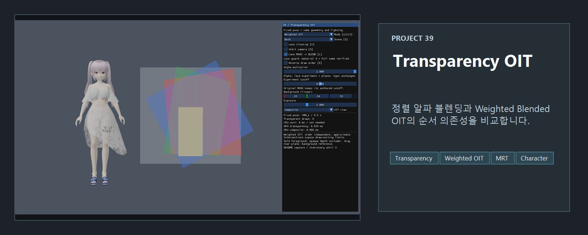
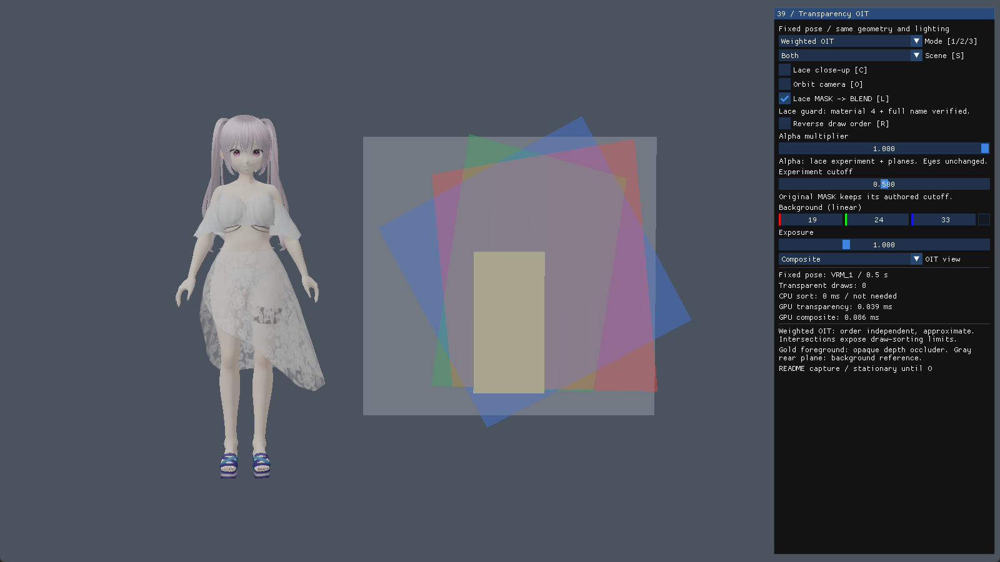
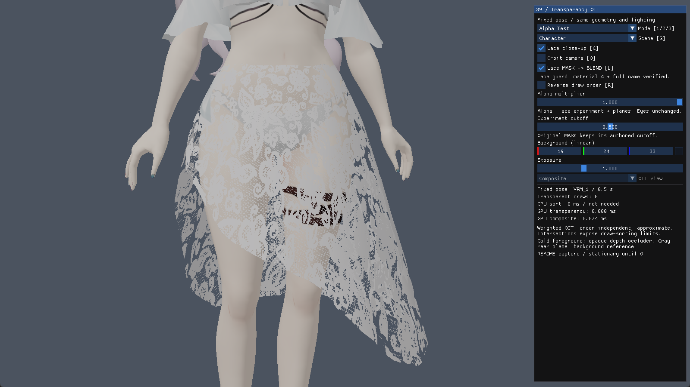
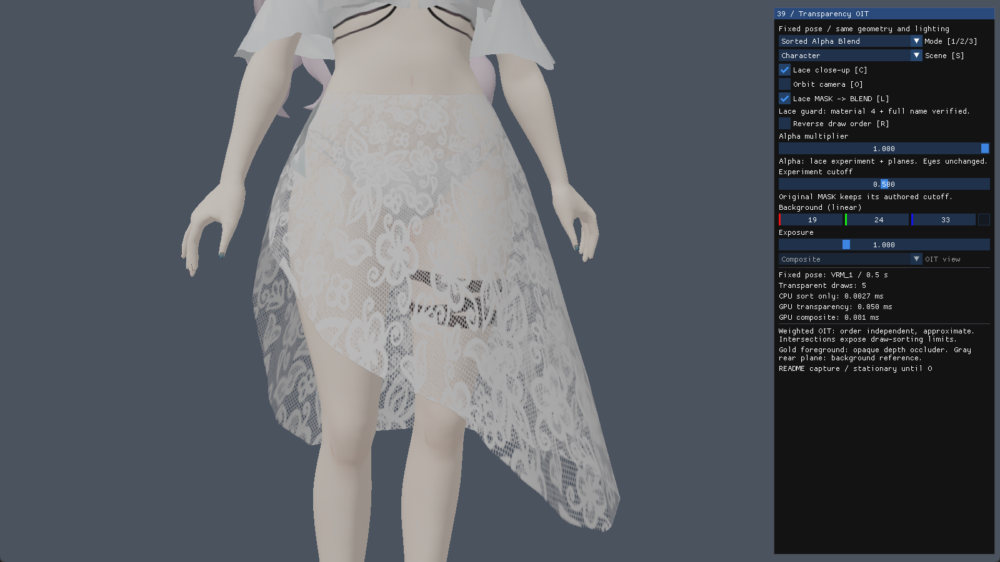
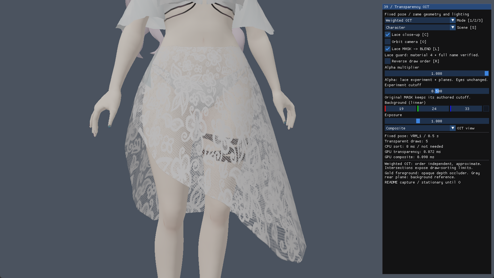

<!-- README-NAV-TOP:START -->
<div align="center">

[이전](../38_StylizedToonPBR/README.md) | [메인](../../README.md) | [상위](../) | 다음

</div>
<!-- README-NAV-TOP:END -->

<!-- README-INFO:START -->
<p align="center"></p>
<!-- README-INFO:END -->

# 39. Transparency OIT

깊이 쓰기를 껐는데도 반투명 면은 왜 그리는 순서에 따라 다르게 보일까요?

직접 만든 VRM 캐릭터를 GLB로 내보낸 `SampleModel.glb`로 알파 테스트, 정렬 알파 블렌딩, Weighted Blended OIT를 비교합니다. 치마 레이스의 중간 알파값은 실제 재질을 실험 대상으로 바꾸어 관찰하고, 교차하는 색상 사각형 3장은 정렬의 한계를 쉽게 보여 줍니다.

20번에서 깊이와 알파의 관계를, 35번에서 MRT를, 38번에서 캐릭터 재질과 반투명 서브셋 정렬을 다뤘습니다. 이번에는 셰이딩보다 **반투명 색을 합성하는 방식**에 집중합니다. 카메라를 돌려도 캐릭터 포즈와 조명은 고정됩니다.

## 세 가지 모드

| 모드 | 처리 | 관찰할 것 |
|---|---|---|
| Alpha Test | cutoff보다 작은 알파를 버리고 남은 픽셀은 불투명하게 기록 | 레이스가 남거나 사라지는 이진 판정 |
| Sorted Alpha Blend | 투명 draw 중심의 뷰 깊이를 뒤에서 앞으로 정렬해 OVER 합성 | 교차 면은 픽셀마다 앞뒤가 바뀌므로 중심 정렬만으로 해결되지 않음 |
| Weighted Blended OIT | 색·알파의 가중 합과 배경이 남는 비율을 MRT에 누적 | 순서를 뒤집어도 거의 같은 결과, 대신 정확한 OVER와는 다른 근사 색 |

`Reverse draw order`는 실제 제출 순서를 뒤집습니다. Sorted 모드에서는 **정렬이 끝난 목록도 역전**하므로 의도적으로 잘못된 순서를 만드는 실험입니다. OIT는 정렬하지 않으며 부동소수점 누적 오차를 제외하면 순서에 거의 영향을 받지 않습니다.

## 원본 재질과 레이스 실험

기본 실행은 glTF에 기록된 `OPAQUE`, `MASK`, `BLEND`와 `alphaCutoff`를 따릅니다. 원본 레이스는 `MASK`이므로, 중간 알파를 관찰하려면 `Lace MASK -> BLEND`를 켭니다. 모델 파일은 바꾸지 않고 인덱스 4와 이름 `N00_002_01_Tops_01_CLOTH_02 (Instance)`가 일치하는 재질만 예제 안에서 `BLEND`로 다룹니다.

Alpha Test 비교 모드에서는 BLEND 재질을 실험 cutoff로 잘라 그립니다. 원래 MASK였던 다른 재질은 원래 cutoff를 유지합니다. 알파 배율은 실험 레이스와 색상 사각형에만 적용하며, 눈처럼 원래 BLEND인 다른 재질의 알파는 임의로 줄이지 않습니다. baseColorFactor와 텍스처 알파는 재질 입력에 반영됩니다. [glTF 알파 규격](https://registry.khronos.org/glTF/specs/2.0/glTF-2.0.html#alpha-coverage)

## 렌더링 경로

```text
불투명·MASK → HDR 색상 + 깊이
                         ↓ 깊이 테스트 ON / 반투명 깊이 쓰기 OFF
반투명     → Accumulation + Revealage
                         ↓ Resolve: 선형 HDR 합성
최종 HDR   → 노출·톤매핑·sRGB 출력 → ImGui
```

| OIT 타깃 | 포맷 | 초기값 | 블렌드 |
|---|---|---|---|
| Accumulation | R16G16B16A16_FLOAT | 0 | ONE + ONE |
| Revealage | R16_FLOAT | 1 | ZERO + INV_SRC_COLOR |

MRT별 블렌드 식이 다르므로 `IndependentBlendEnable`을 켭니다. Revealage에는 각 조각의 알파를 출력하고 기존 값에 `1 - alpha`를 곱합니다. 스칼라 R 채널이므로 `INV_SRC_COLOR`를 사용합니다. [D3D11 블렌드 상태](https://learn.microsoft.com/en-us/windows/win32/api/d3d11/ns-d3d11-d3d11_blend_desc)

```text
accum.rgb = Σ(linearColor × alpha × weight)
accum.a   = Σ(alpha × weight)
reveal    = Π(1 - alpha)

weightedColor = accum.rgb / accum.a
coverage      = 1 - reveal
finalHDR      = weightedColor × coverage + opaqueHDR × reveal
```

`accum.a`가 0인 픽셀은 불투명 장면을 그대로 사용합니다. 알파가 0인 투명 조각은 버리므로 색과 깊이를 바꾸지 않습니다. 깊이 테스트는 계속 켜져 있어 불투명 가림판 뒤의 반투명 면은 누적되지 않습니다.

### 가중치와 깊이 공간

```text
depth  = saturate((viewDepth - nearPlane) / (farPlane - nearPlane))
weight = clamp(0.01 + 8 × (1 - depth)³, 0.01, 8)
```

여기서 depth는 깊이 버퍼의 비선형 z가 아니라 **정규화한 선형 뷰 깊이**입니다. 가까운 조각에 더 큰 가중치를 주며 near/far 범위를 바꾸면 색의 근사도 달라집니다. 색은 선형 공간에서 합성하고 마지막에 한 번만 화면 출력으로 변환합니다.

FP16 누적의 여유를 위해 조각당 선형 색 기여를 [0, 8]로 제한합니다. 합성에서는 0 나눗셈과 비유한 값도 방어하지만, 임의로 많은 층의 정확한 색을 복원하거나 overflow 자체를 무한히 방지하는 방식은 아닙니다.

## 직접 바꿔 보기

| 입력 / UI | 기능 |
|---|---|
| 1 / 2 / 3 | Alpha Test / Sorted Alpha Blend / Weighted Blended OIT |
| L | `Lace MASK -> BLEND`: 레이스 재질만 BLEND로 바꾸는 실험 켜기/끄기 |
| R | 실제 투명 draw 순서 역전 |
| O | 고정 포즈를 바라보며 카메라 회전 |
| C | 전신 / 레이스 확대 구도. 확대할 때 Character 장면을 선택 |
| S | 캐릭터와 사각형 / 캐릭터 / 사각형 장면 전환. Planes를 선택하면 확대를 해제 |
| Alpha multiplier / Cutoff | 실험 표면의 알파 배율 / Alpha Test 임계값 |
| Background / Exposure | 배경색 / 모든 모드에 공통인 노출 |
| Debug view | Weighted OIT 모드에서 최종 합성 / 정규화한 누적 색 / Revealage |

색상 사각형 장면에서 R을 눌러 본 뒤, 레이스 실험을 켜고 확대 구도에서 1–3번을 바꿔 보세요. Revealage가 밝을수록 배경이 많이 남고, 검정에 가까울수록 투명 층에 의해 배경이 많이 가려진 픽셀입니다. 값 1은 배경이 전부 남는 상태이며, 디버그 표시에도 노출·톤매핑이 적용되므로 화면의 밝기 자체가 저장된 값은 아닙니다. Accumulation 보기는 원시 합을 그대로 표시하지 않고 가중 알파로 나눈 색을 표시합니다.

## 측정과 한계

- CPU 정렬 시간은 투명 draw 목록을 정렬하는 구간입니다. OIT에는 정렬이 필요하지 않습니다.
- GPU 투명 패스와 Resolve 합성 시간을 따로 표시합니다. 쿼리는 비동기로 확인하고 준비되지 않으면 기다리지 않습니다. `warming up`/`unavailable`은 측정 준비·지원 상태이며 렌더링 오류와 구분합니다.
- GPU 합계나 표시된 두 구간을 Present, UI, 드라이버 대기까지 포함한 앱 전체 시간으로 해석하지 않습니다. README의 고정 벤치마크 숫자 대신 같은 해상도와 장면에서 실행 중 값을 비교합니다.
- Weighted Blended OIT는 근사법입니다. 특히 알파가 1에 가까운 서로 다른 색의 층은 앞면이 완전히 덮기보다 색이 섞일 수 있습니다. 삼각형을 픽셀별로 정확히 정렬한 기준 결과는 구현하지 않았습니다. [McGuire·Bavoil 원 논문](https://jcgt.org/published/0002/02/09/)
- 38번의 반투명 깊이·노멀 기록, 반투명 외곽선·그림자는 가져오지 않았습니다. MSAA/Alpha-to-Coverage 역시 별도 주제이며 이 예제는 단일 샘플 타깃을 사용합니다.

## 코드와 검증

표면과 draw 목록은 [App.cpp](App.cpp), 재질 분류·정렬은 [SceneTransparency.cpp](SceneTransparency.cpp), 상태와 타깃·합성 패스는 [OitPipeline.cpp](OitPipeline.cpp)에 있습니다. [공유 OIT 함수](39_Transparency.fxh)와 [합성 셰이더](39_Resolve.hlsl)를 함께 읽으면 누적과 Resolve가 어떻게 연결되는지 볼 수 있습니다.

```powershell
pwsh -NoProfile -File tools/tests/test_oit_pipeline.ps1
pwsh -NoProfile -File tools/tests/test_scene_transparency.ps1
```

저장소 루트에서 실행합니다. 첫 테스트는 WARP에서 실제 앱 코드와 HLSL을 실행한 뒤 픽셀을 읽어 빈 패스·단층 합성·순서 역전·불투명 가림·알파 0·리사이즈를 검사합니다. 두 번째는 실제 앱이 사용하는 재질 분류와 정렬 함수를 검사합니다.

<!-- README-RUNTIME:START -->
## 실행 화면

| Screenshot | GIF |
|---|---|
|  |  |
<!-- README-RUNTIME:END -->

### 같은 레이스의 세 모드

| Alpha Test | Sorted Alpha Blend | Weighted Blended OIT |
|---|---|---|
|  |  |  |

같은 정면 구도에서 Alpha Test는 레이스가 거칠게 잘린 모습이고 두 블렌딩 결과는 부드러우며 서로 매우 가깝습니다. 이 고정 구도만으로 Sorted와 OIT의 차이를 과장해 해석하지 않고, 교차 사각형 장면에서 제출 순서를 뒤집어 순서 의존성을 확인합니다.

<!-- README-NAV-BOTTOM:START -->
<div align="center">

[이전](../38_StylizedToonPBR/README.md) | [메인](../../README.md) | [상위](../) | 다음

</div>
<!-- README-NAV-BOTTOM:END -->
