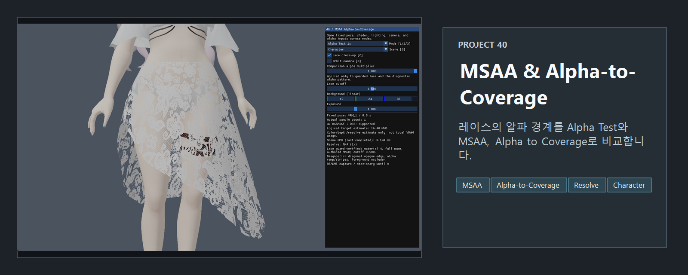
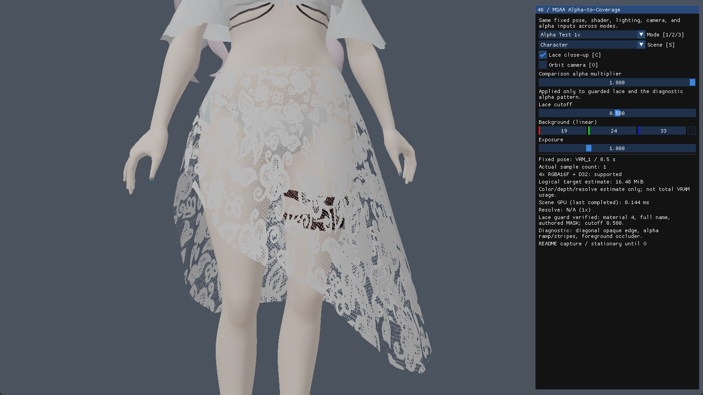
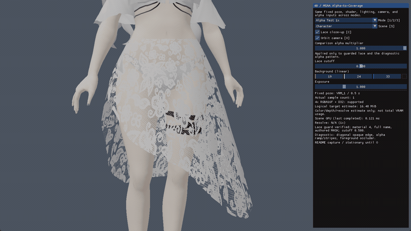

<!-- README-NAV-TOP:START -->
<div align="center">

[이전](../39_Transparency_OIT/README.md) | [메인](../../README.md) | [상위](../) | 다음

</div>
<!-- README-NAV-TOP:END -->

<!-- README-INFO:START -->
<p align="center"></p>
<!-- README-INFO:END -->

# 40. MSAA & Alpha-to-Coverage

39번은 여러 반투명 면을 합성하는 순서를 비교했습니다. 40번은 같은 캐릭터의 레이스를 확대해 삼각형 바깥선과 텍스처 알파로 만든 안쪽 경계가 멀티샘플링에서 어떻게 달라지는지 살펴봅니다.

기본 화면은 Alpha Test 1x, 고정 포즈, 정지 카메라입니다. 모드를 바꿔도 카메라·포즈·배경·알파·cutoff·노출은 유지되므로 같은 조건에서 경계를 비교할 수 있습니다.

## 세 모드와 두 경계

| 모드 | 색상·깊이 샘플 | 비교 레이스 처리 | 관찰할 것 |
|---|---:|---|---|
| Alpha Test 1x | 1 | cutoff보다 작은 알파를 `clip` | 텍스처 경계가 픽셀 단위로 잘리는 기준 화면 |
| Alpha Test 4x MSAA | 4 | 1x와 같은 셰이더와 cutoff | 삼각형 경계는 샘플 커버리지를 얻지만 레이스 안쪽은 여전히 이진 판정 |
| A2C 4x MSAA | 4 | 중간 알파를 샘플 커버리지로 변환 | 제한된 4개 샘플에서 생기는 부분 커버리지와 단계 |

MSAA는 삼각형의 기하 경계를 여러 샘플에서 평가합니다. 반면 Alpha Test의 `clip` 결과는 그 픽셀을 남길지 버릴지 정하므로 4x 타깃만 사용한다고 텍스처 알파 경계가 모두 부드러워지지는 않습니다. A2C는 알파를 일반 색상 블렌딩이 아니라 샘플 커버리지로 바꾸어 이 차이를 비교합니다. [Alpha-to-Coverage](https://learn.microsoft.com/en-us/windows/win32/direct3d11/d3d10-graphics-programming-guide-blend-state#alpha-to-coverage)

## 원본 MASK와 비교용 A2C

원본 레이스는 glTF `MASK` 재질입니다. 재질 인덱스 4, 전체 이름 `N00_002_01_Tops_01_CLOTH_02 (Instance)`, 원본 `MASK`가 모두 맞을 때만 비교 처리를 적용합니다. 조건이 어긋나면 다른 재질을 대신 고르지 않고 원본 처리와 비활성 이유를 표시합니다.

Alpha Test는 선택한 cutoff로 자른 뒤 불투명하게 쓰고, A2C는 cutoff로 이진화하지 않은 중간 알파를 출력합니다. 따라서 A2C 화면은 원본 MASK를 그대로 보존한 결과가 아니라 학습을 위한 비교입니다. 알파 0은 두 경로 모두 버립니다. 눈처럼 원래 `BLEND`인 재질은 모든 모드에서 뒤에서 앞으로 정렬하고 straight-alpha OVER, 깊이 쓰기 OFF로 그리며 A2C를 적용하지 않습니다.

## 멀티샘플 타깃과 조작

```text
불투명·원본 MASK·비교 레이스 → R16G16B16A16_FLOAT + D32_FLOAT
                                      ↓
원본 BLEND                    → 정렬 블렌딩, 깊이 쓰기 OFF
                                      ↓
4x: ResolveSubresource / 1x: 색상 타깃 직접 사용
                                      ↓
노출·Reinhard 톤매핑·sRGB 변환 → 단일 샘플 백버퍼 → ImGui
```

4x 색상 타깃은 같은 크기의 단일 샘플 HDR 텍스처로 Resolve합니다. 깊이는 Resolve하지 않으며, 1x에서는 별도 복사 없이 색상 SRV를 사용합니다. 선형 HDR에서 Resolve한 뒤 화면 변환은 한 번만 적용합니다. [ResolveSubresource 조건](https://learn.microsoft.com/en-us/windows/win32/api/d3d11/nf-d3d11-id3d11devicecontext-resolvesubresource)

| 입력 / UI | 기능 |
|---|---|
| 1 / 2 / 3 | Alpha Test 1x / Alpha Test 4x / A2C 4x |
| C | 전신 / 레이스 확대 구도 |
| O | 정지 / 느린 카메라 회전 |
| S | 캐릭터 / 진단 장면 |
| Comparison alpha / Lace cutoff | 비교 표면의 알파 배율 / Alpha Test 임계값. A2C에서는 cutoff 편집 비활성 |
| Background / Exposure | 모든 모드에 공통인 배경색 / 노출 |

4x가 지원되지 않으면 두 4x 선택을 거부하고 이유를 표시합니다. 1x를 4x라고 표시하는 대체 경로는 사용하지 않습니다. 진단 장면은 불투명 대각선 경계, 알파 경사와 가는 줄무늬, 앞쪽 가림판을 함께 보여 줍니다.

<!-- README-RUNTIME:START -->
## 실행 화면

| Screenshot | GIF |
|---|---|
|  |  |
<!-- README-RUNTIME:END -->

### 같은 레이스의 세 모드

| Alpha Test 1x | Alpha Test 4x MSAA | A2C 4x MSAA |
|---|---|---|
|  |  |  |

같은 고정 구도에서 Alpha Test 1x와 4x는 레이스 안쪽의 이진 잘림이 비슷하게 남습니다. A2C 4x는 중간 알파의 레이스 무늬를 더 남겨 이 구도에서는 촘촘하고 덜 거칠게 보입니다. 이 한 장면이 모든 시점의 화질이나 시간축 안정성을 보장하지는 않습니다. 진단 장면에서도 A2C 커버리지는 4개 샘플에 따른 유한한 단계로 나타납니다.

## 코드와 검증, 측정 한계

앱 연결과 draw 구성은 [App.cpp](App.cpp), 재질 선택과 정렬은 [CoverageScene.cpp](CoverageScene.cpp), 멀티샘플 타깃·상태·Resolve는 [MsaaPipeline.cpp](MsaaPipeline.cpp)에 있습니다. [표면 셰이더](40_Surface.hlsl)와 [공유 알파 함수](40_AlphaCoverage.fxh)는 앱과 WARP 픽셀 테스트가 같은 알파 규칙을 사용하도록 연결합니다.

저장소 루트에서 `tools/tests/test_coverage_scene.ps1`로 재질·정렬·메모리 산식을, `tools/tests/test_msaa_pipeline.ps1`로 앱 파이프라인과 HLSL의 픽셀·Resolve·상태 복원·전환·측정 동작을 검사할 수 있습니다. 이전 예제의 `tools/tests/test_oit_pipeline.ps1`와 `tools/tests/test_scene_transparency.ps1`도 회귀 검사에 포함됩니다.

- GPU 시간은 장면 구간과 4x Resolve 구간만 측정합니다. 최종 화면 변환, ImGui, swap-chain Present, CPU·드라이버 대기는 포함하지 않으며 1x Resolve는 실행하지 않아 `N/A`입니다. 화면에 보이는 값만으로 고정 성능 순위를 정하지 않습니다.
- 메모리 값은 `W×H×12`(1x), `W×H×(4×12+8)`(4x) 바이트로 계산한 활성 색상·깊이·Resolve 타깃의 논리적 저장량입니다. 백버퍼, 모델, 텍스처, 드라이버 정렬·압축, 모드 전환 중 임시 자원은 제외하므로 VRAM 사용량이 아닙니다.
- A2C의 샘플 배치는 하드웨어에 따라 달라질 수 있고 샘플 수가 적으면 단계나 노이즈가 남습니다. 여러 반투명 층의 색을 합성하는 기능이나 OIT 대체 방식도 아닙니다.
- 지원 장치에서 4x 실행과 WARP 픽셀 경로를 확인했지만 미지원 장치의 UI는 유도하지 않았습니다. 앱 실행 중 D3D 디버그 로그는 수집하지 않았으며, WARP 픽스처의 InfoQueue 검사 결과와 구분합니다.

<!-- README-NAV-BOTTOM:START -->
<div align="center">

[이전](../39_Transparency_OIT/README.md) | [메인](../../README.md) | [상위](../) | 다음

</div>
<!-- README-NAV-BOTTOM:END -->
