# D3D11-AliceTutorial


이 저장소는 [DirectX SDK Samples - Direct3D11 Tutorials](https://github.com/walbourn/directx-sdk-samples/tree/main/Direct3D11Tutorials) 을 기반으로  
D3D 그래픽스를 학습하면서 정리한 튜토리얼 프로젝트입니다.

- 환경: Windows 11, Visual Studio 2022
- 플랫폼: Win32 Desktop (Direct3D 11.0)
- 목적: DirectX 11 그래픽스 파이프라인의 기초 학습 및 3D 기능 탐구

| [Youtube](https://www.youtube.com/playlist?list=PLbPdrhrt0AJgCSKYyzjAjHwpQ_Yt4uBMx) | [Velog](https://velog.io/@whoamicj/series/DirectX11) |
|---|---|
| <div align="center">[](https://www.youtube.com/playlist?list=PLbPdrhrt0AJgCSKYyzjAjHwpQ_Yt4uBMx)<br/></div> | <div align="center">[](https://velog.io/@whoamicj/series/DirectX11)<br/></div> |


## 대표 데모

[`36_AdvancedAnim_Sound_Click`](Dx11/36_AdvancedAnim_Sound_Click)입니다. 모델 로딩, PBR/IBL, 톤매핑, 디퍼드 렌더링 위에 애니메이션 블렌딩, 레이어, IK, 소켓, FMOD 3D 사운드, ImGui 디버그 UI, 멀티스레드 로딩을 담은 최종 데모입니다.

| Screenshot | GIF |
|---|---|
| 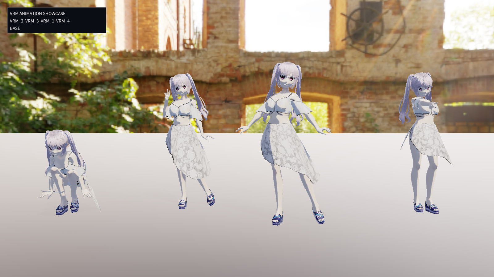 | 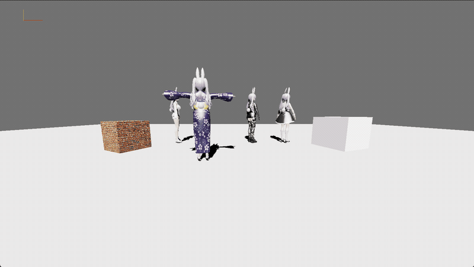 |

| 항목 | 내용 |
|---|---|
| 실행 | `Dx11/TutorialApp.sln` 열기 -> `36_AdvancedAnim_Sound_Click` 시작 프로젝트 -> `x64` 빌드 |
| 렌더링 | 포트폴리오 Forward 경로, Shadow, PBR, IBL, Tone Mapping (`35_DeferredRendering`에 Deferred 단계) |
| 애니메이션 | Blend, Additive, Layer, IK, Socket |
| 사운드/UI | FMOD 3D Sound, SoundBox, ImGui Debug Panels |
| 구조 | `Dx11/Common` 공통 코드 + `35_DeferredRendering` 렌더링 단계 + `36_AdvancedAnim_Sound_Click` 통합 데모 |

### 코드 구조 요약

```text
Dx11/Common/                         공통 D3D 앱, 카메라, 메시, 애니메이션, 사운드, 로더
Dx11/35_DeferredRendering/           G-Buffer, Deferred Lighting, Tone Mapping
Dx11/36_AdvancedAnim_Sound_Click/    대표 통합 데모
  App.cpp                            구현 파일 인덱스
  App_*.inl                          수명주기, 입력/업데이트, 렌더 패스, 모델 로딩, UI, 유틸리티
```

## 스타일라이즈드 렌더링 쇼케이스

[`38_StylizedToonPBR`](Dx11/38_StylizedToonPBR)는 공개 캐릭터 하나를 같은 카메라와 조명에서 `PBR`, `Hybrid Toon-PBR`, `Split`으로 비교하는 집중형 샘플입니다. 실제 몸·얼굴 피부만 따뜻하게 분리하고 흰 의상과 얼굴 오버레이는 중립으로 유지하는 재질별 응답, 화면 공간 Normal/Depth 외곽선, 두 개의 독자적 조명 프리셋, 비동기 GPU 패스 측정을 한 프로젝트에서 확인할 수 있습니다.

| Screenshot | 핵심 비교 |
|---|---|
| 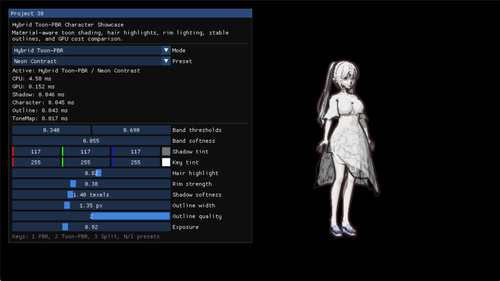 | `Neon Contrast` / `Industrial Soft`<br/>Shadow, Character, Outline, ToneMap GPU timing<br/>픽셀 폭 외곽선 품질 비교 |

### 프로젝트 바로가기

각 프로젝트 README에서 새 실행 스크린샷과 짧은 GIF를 함께 확인할 수 있습니다.

- 이미지를 클릭하거나, 아래 각 번호/이름을 클릭해도 해당 디렉토리로 이동합니다

| [1. RenderingQuadangle](https://github.com/Chang-Jin-Lee/D3D11-AliceTutorial/tree/main/Dx11/01_RenderingQuadangle) | [2. RenderingCube](https://github.com/Chang-Jin-Lee/D3D11-AliceTutorial/tree/main/Dx11/02_RenderingCube) | [3. RenderingMeshAndSceneGraph](https://github.com/Chang-Jin-Lee/D3D11-AliceTutorial/tree/main/Dx11/03_RenderingMeshAndSceneGraph) | [4. RenderingMeshWithTexture](https://github.com/Chang-Jin-Lee/D3D11-AliceTutorial/tree/main/Dx11/04_RenderingMeshWithTexture) |
|---|---|---|---|
| <div align="center">[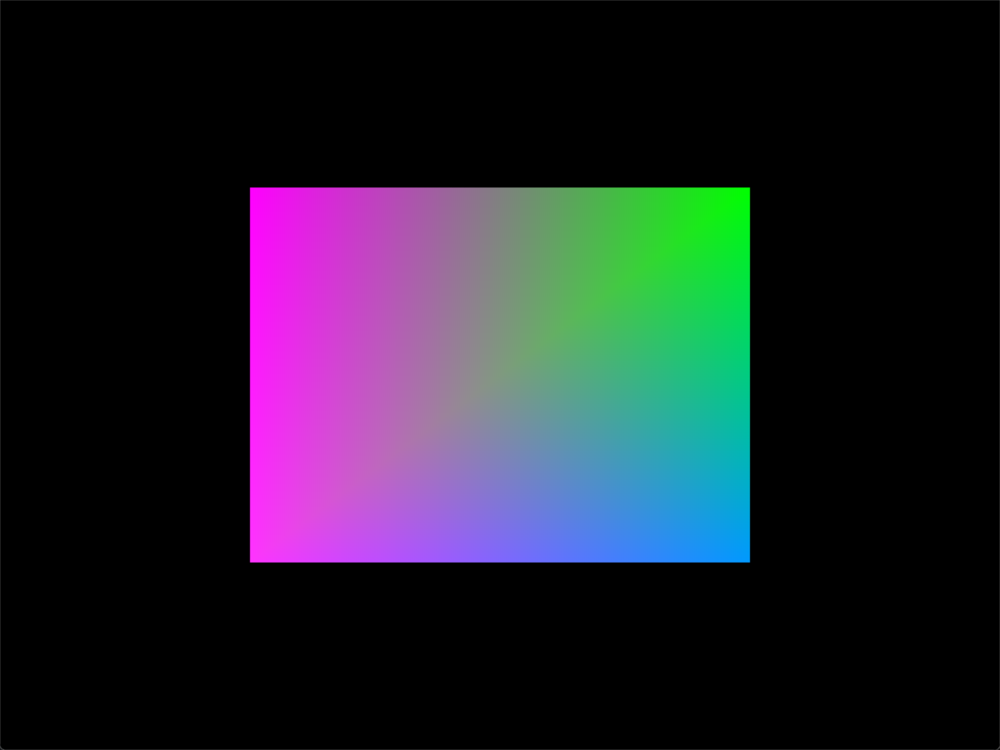](https://github.com/Chang-Jin-Lee/D3D11-AliceTutorial/tree/main/Dx11/01_RenderingQuadangle)</div> | <div align="center">[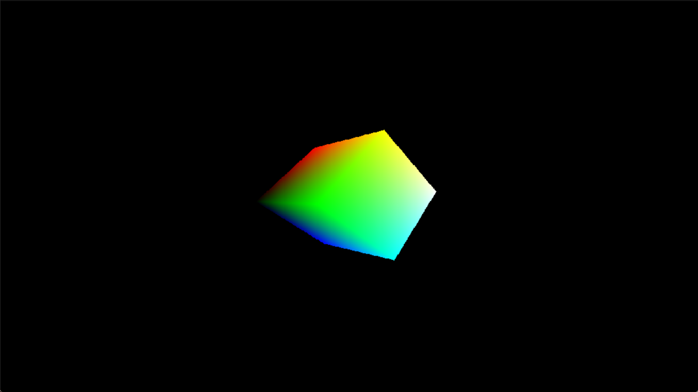](https://github.com/Chang-Jin-Lee/D3D11-AliceTutorial/tree/main/Dx11/02_RenderingCube)</div> | <div align="center">[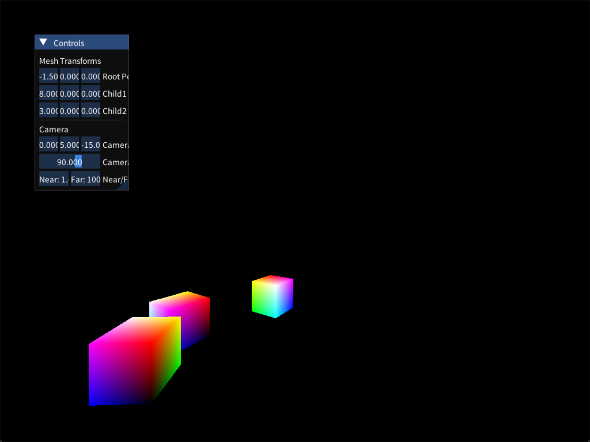](https://github.com/Chang-Jin-Lee/D3D11-AliceTutorial/tree/main/Dx11/03_RenderingMeshAndSceneGraph)</div> | <div align="center">[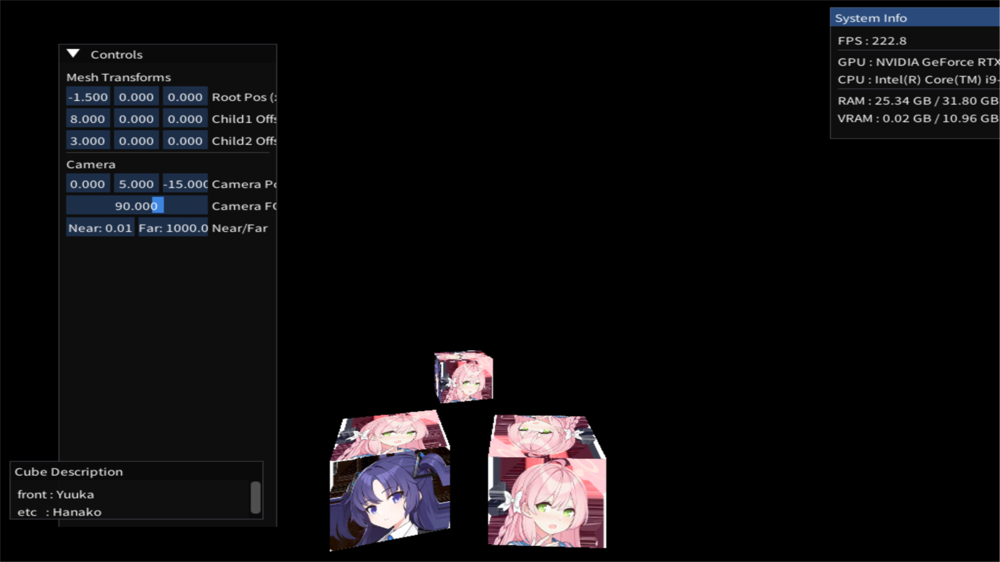](https://github.com/Chang-Jin-Lee/D3D11-AliceTutorial/tree/main/Dx11/04_RenderingMeshWithTexture)</div> |

| [5. MeshFBX](https://github.com/Chang-Jin-Lee/D3D11-AliceTutorial/tree/main/Dx11/05_Mesh) | [6. PMX A-Pose](https://github.com/Chang-Jin-Lee/D3D11-AliceTutorial/tree/main/Dx11/06_pmx) | [7. PMX Texture](https://github.com/Chang-Jin-Lee/D3D11-AliceTutorial/tree/main/Dx11/07_pmxTexture) | [8. ImguiSystemInfo](https://github.com/Chang-Jin-Lee/D3D11-AliceTutorial/tree/main/Dx11/08_ImguiSystemInfo) |
|---|---|---|---|
| <div align="center">[](https://github.com/Chang-Jin-Lee/D3D11-AliceTutorial/tree/main/Dx11/05_Mesh)</div> | <div align="center">[](https://github.com/Chang-Jin-Lee/D3D11-AliceTutorial/tree/main/Dx11/06_pmx)</div> | <div align="center">[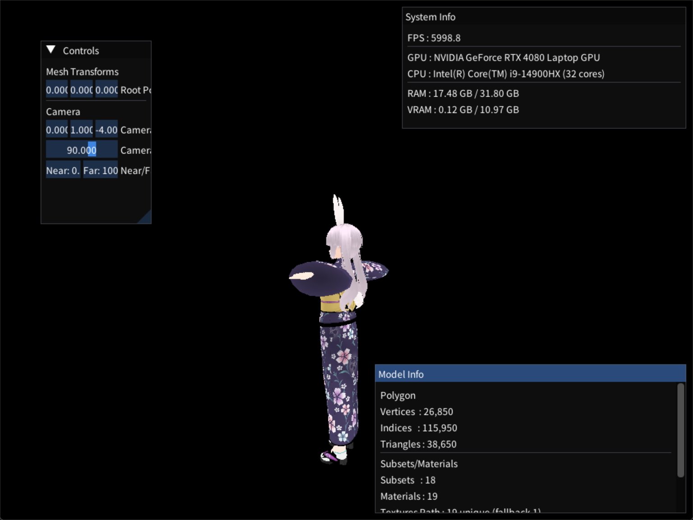](https://github.com/Chang-Jin-Lee/D3D11-AliceTutorial/tree/main/Dx11/07_pmxTexture)</div> | <div align="center">[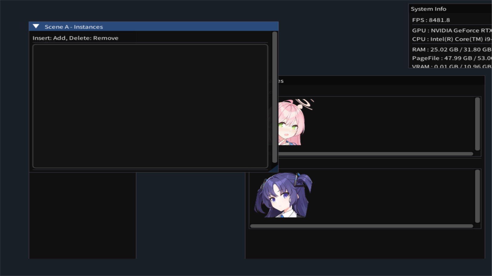](https://github.com/Chang-Jin-Lee/D3D11-AliceTutorial/tree/main/Dx11/08_ImguiSystemInfo)</div> |

| [9. Lighting](https://github.com/Chang-Jin-Lee/D3D11-AliceTutorial/tree/main/Dx11/09_Lighting) | [10. Static Cube SkyBox](https://github.com/Chang-Jin-Lee/D3D11-AliceTutorial/tree/main/Dx11/10_StaticCube_SkyBox) | [11. Live2D](https://github.com/Chang-Jin-Lee/D3D11-AliceTutorial/tree/main/Dx11/11_Live2D) | [12. Lighting Blinn Phong](https://github.com/Chang-Jin-Lee/D3D11-AliceTutorial/tree/main/Dx11/12_Lighting_BlinnPhong) |
|---|---|---|---|
| <div align="center">[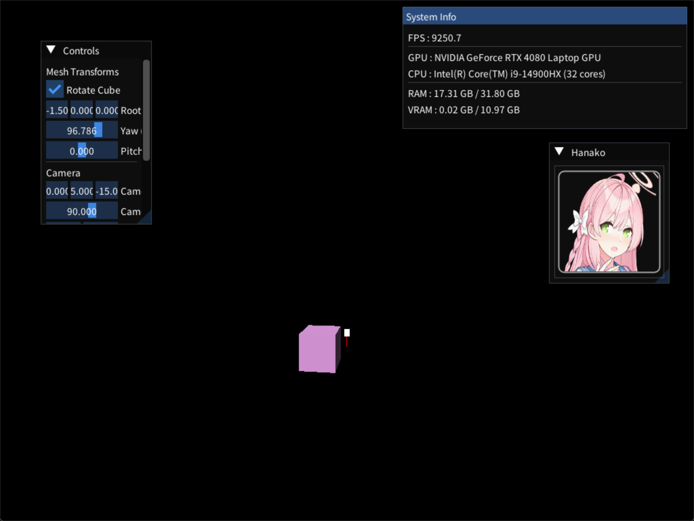](https://github.com/Chang-Jin-Lee/D3D11-AliceTutorial/tree/main/Dx11/09_Lighting)</div> | <div align="center">[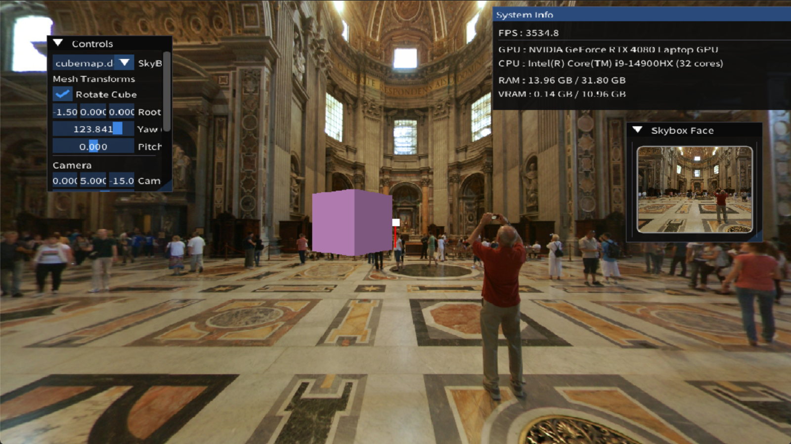](https://github.com/Chang-Jin-Lee/D3D11-AliceTutorial/tree/main/Dx11/10_StaticCube_SkyBox)</div> | <div align="center">[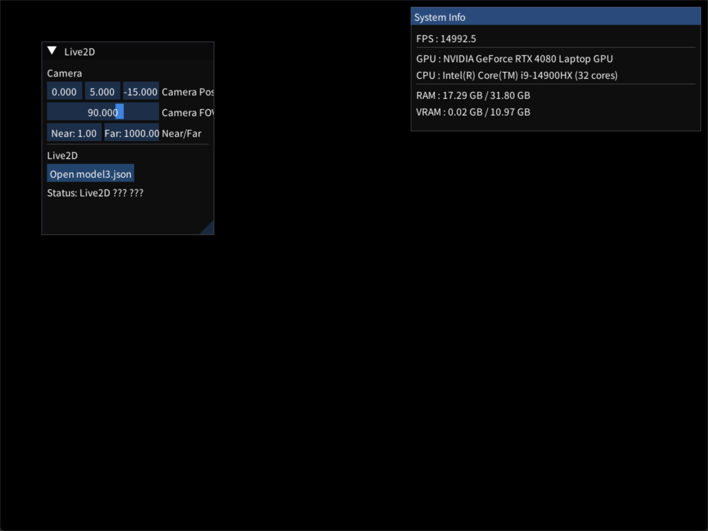](https://github.com/Chang-Jin-Lee/D3D11-AliceTutorial/tree/main/Dx11/11_Live2D)</div> | <div align="center">[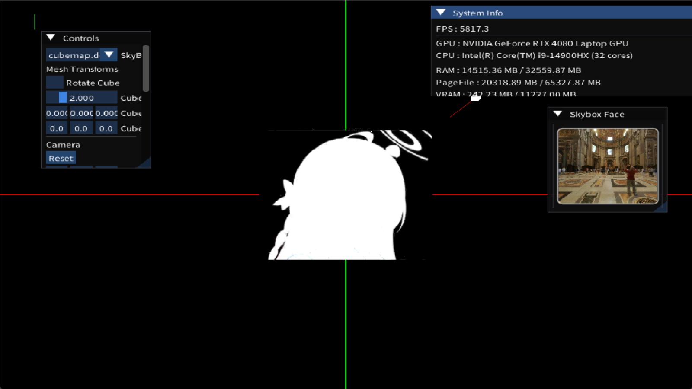](https://github.com/Chang-Jin-Lee/D3D11-AliceTutorial/tree/main/Dx11/12_Lighting_BlinnPhong)</div> |

| [13. LineRenderer AxisDebug](https://github.com/Chang-Jin-Lee/D3D11-AliceTutorial/tree/main/Dx11/13_LineRenderer_AxisDebug) | [14. Lighting Phong](https://github.com/Chang-Jin-Lee/D3D11-AliceTutorial/tree/main/Dx11/14_Lighting_Phong) | [15. pmx With Phong](https://github.com/Chang-Jin-Lee/D3D11-AliceTutorial/tree/main/Dx11/15_pmxWithPhong) | [16. Texture Normal Mapping](https://github.com/Chang-Jin-Lee/D3D11-AliceTutorial/tree/main/Dx11/16_NormalMapping) |
|---|---|---|---|
| <div align="center">[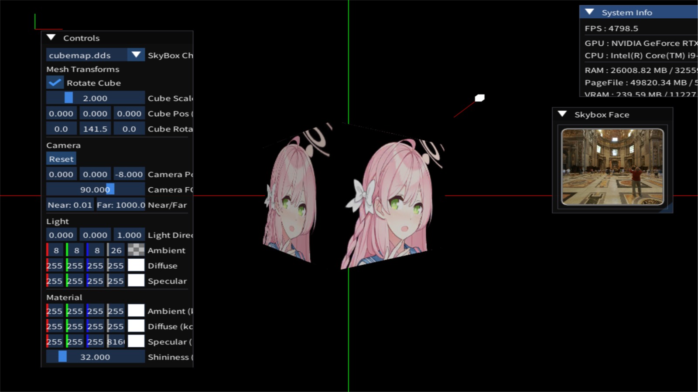](https://github.com/Chang-Jin-Lee/D3D11-AliceTutorial/tree/main/Dx11/13_LineRenderer_AxisDebug)</div> | <div align="center">[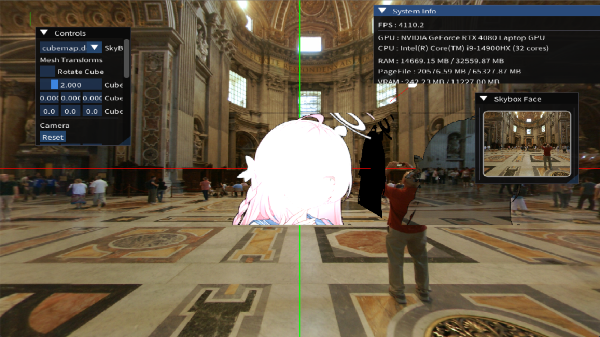](https://github.com/Chang-Jin-Lee/D3D11-AliceTutorial/tree/main/Dx11/14_Lighting_Phong)</div> | <div align="center">[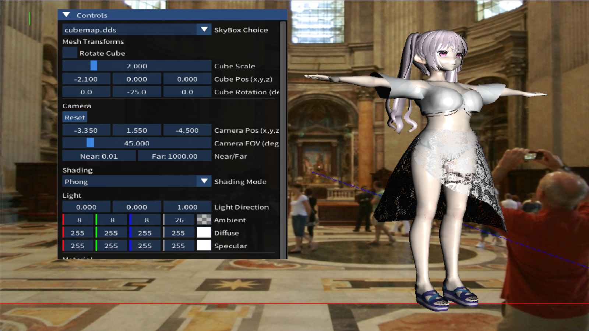](https://github.com/Chang-Jin-Lee/D3D11-AliceTutorial/tree/main/Dx11/15_pmxWithPhong)</div> | <div align="center">[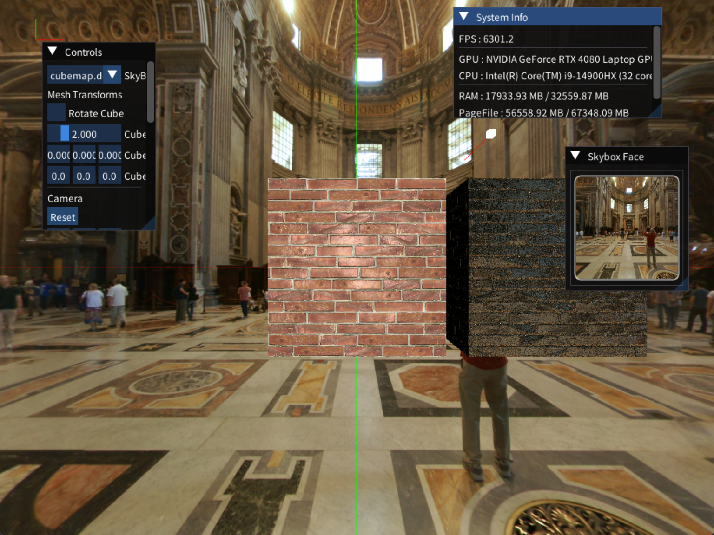](https://github.com/Chang-Jin-Lee/D3D11-AliceTutorial/tree/main/Dx11/16_NormalMapping)</div> |

| [17. Render fbx pmx obj](https://github.com/Chang-Jin-Lee/D3D11-AliceTutorial/tree/main/Dx11/17_fbx_pmx_obj_WithPhong) | [18. fbx Animation](https://github.com/Chang-Jin-Lee/D3D11-AliceTutorial/tree/main/Dx11/18_fbx_Animation) | [19. MultiModels](https://github.com/Chang-Jin-Lee/D3D11-AliceTutorial/tree/main/Dx11/19_MultiModels) | [20. Depth And Alpha Issue](https://github.com/Chang-Jin-Lee/D3D11-AliceTutorial/tree/main/Dx11/20_Depth_And_Alpha_Issue) |
|---|---|---|---|
| <div align="center">[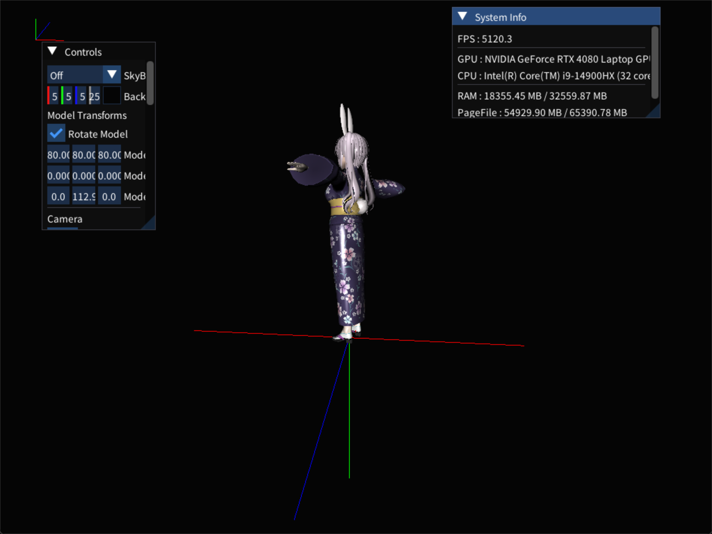](https://github.com/Chang-Jin-Lee/D3D11-AliceTutorial/tree/main/Dx11/17_fbx_pmx_obj_WithPhong)</div> | <div align="center">[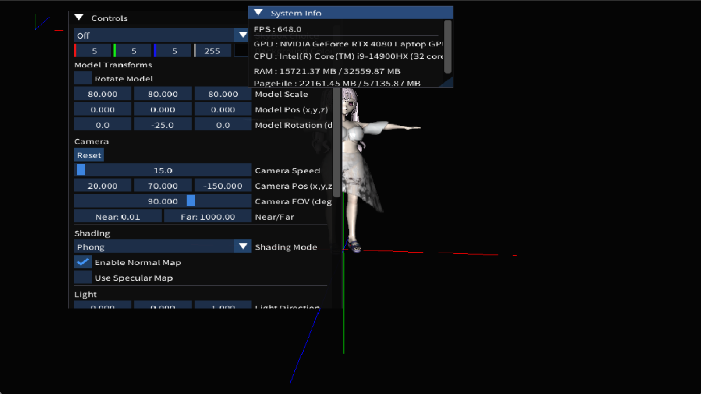](https://github.com/Chang-Jin-Lee/D3D11-AliceTutorial/tree/main/Dx11/18_fbx_Animation)</div> | <div align="center">[](https://github.com/Chang-Jin-Lee/D3D11-AliceTutorial/tree/main/Dx11/19_MultiModels)</div> | <div align="center">[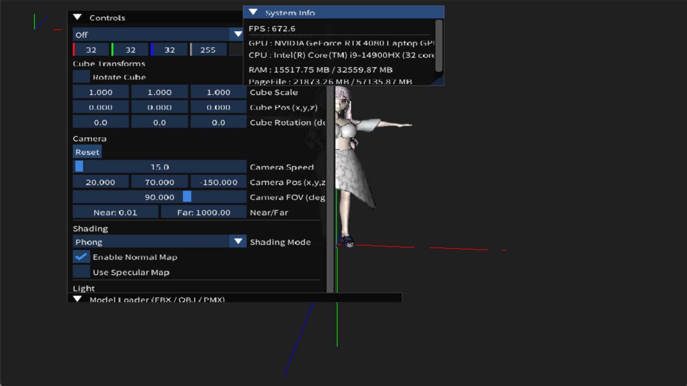](https://github.com/Chang-Jin-Lee/D3D11-AliceTutorial/tree/main/Dx11/20_Depth_And_Alpha_Issue)</div> |

| [21. MultiModels With Animations](https://github.com/Chang-Jin-Lee/D3D11-AliceTutorial/tree/main/Dx11/21_MultiModels_With_Animations) | [22. VMD Camera](https://github.com/Chang-Jin-Lee/D3D11-AliceTutorial/tree/main/Dx11/22_VMD) | [23. Rigid, Skinned Animation](https://github.com/Chang-Jin-Lee/D3D11-AliceTutorial/tree/main/Dx11/23_Rigid_Animation) | [24. Skinned With Bone Structure](https://github.com/Chang-Jin-Lee/D3D11-AliceTutorial/tree/main/Dx11/24_Skinned_With_Bone_Structure) |
|---|---|---|---|
| <div align="center">[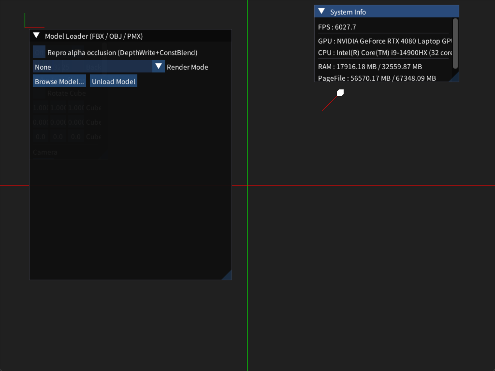](https://github.com/Chang-Jin-Lee/D3D11-AliceTutorial/tree/main/Dx11/21_MultiModels_With_Animations)</div> | <div align="center">[](https://github.com/Chang-Jin-Lee/D3D11-AliceTutorial/tree/main/Dx11/22_VMD)</div>  | <div align="center">[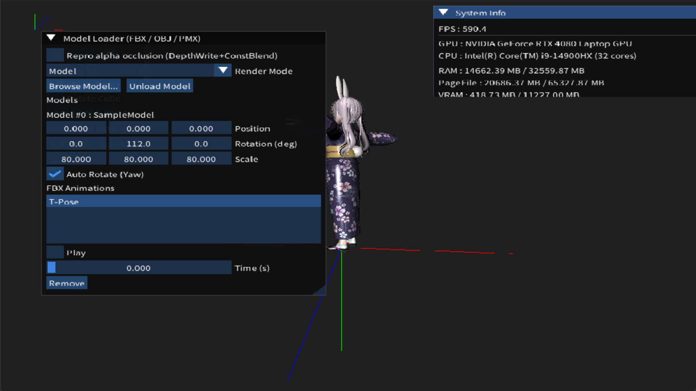](https://github.com/Chang-Jin-Lee/D3D11-AliceTutorial/tree/main/Dx11/23_Rigid_Animation)</div> | <div align="center">[](https://github.com/Chang-Jin-Lee/D3D11-AliceTutorial/tree/main/Dx11/24_Skinned_With_Bone_Structure)</div> |

| [25. ToonShading Outline](https://github.com/Chang-Jin-Lee/D3D11-AliceTutorial/tree/main/Dx11/25_ToonShading_Outline) | [26. ShadowMap PCF](https://github.com/Chang-Jin-Lee/D3D11-AliceTutorial/tree/main/Dx11/26_ShadowMap_PCF) | [27. debug draw box](https://github.com/Chang-Jin-Lee/D3D11-AliceTutorial/tree/main/Dx11/27_DebugDraw) | [28. Scene Shared3DModel Animation](https://github.com/Chang-Jin-Lee/D3D11-AliceTutorial/tree/main/Dx11/28_Scene_Shared3DModel_Animation) |
|---|---|---|---|
| <div align="center">[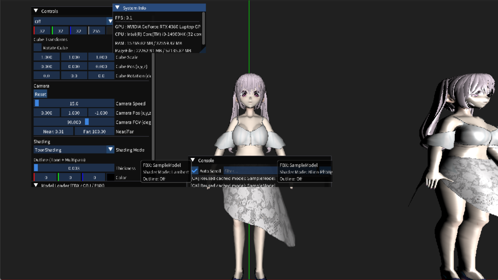](https://github.com/Chang-Jin-Lee/D3D11-AliceTutorial/tree/main/Dx11/25_ToonShading_Outline)</div> | <div align="center">[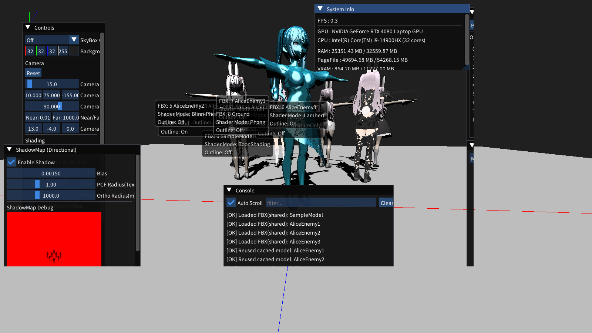](https://github.com/Chang-Jin-Lee/D3D11-AliceTutorial/tree/main/Dx11/26_ShadowMap_PCF)</div> | <div align="center">[](https://github.com/Chang-Jin-Lee/D3D11-AliceTutorial/tree/main/Dx11/27_DebugDraw)</div> | <div align="center">[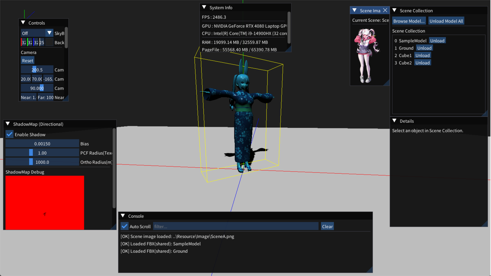](https://github.com/Chang-Jin-Lee/D3D11-AliceTutorial/tree/main/Dx11/28_Scene_Shared3DModel_Animation)</div> |

| [29. Mouse Picking](https://github.com/Chang-Jin-Lee/D3D11-AliceTutorial/tree/main/Dx11/29_MousePicking) | [30. PBR BRDF](https://github.com/Chang-Jin-Lee/D3D11-AliceTutorial/tree/main/Dx11/30_PBR_BRDF) | [31. IBL Image Based Lighting](https://github.com/Chang-Jin-Lee/D3D11-AliceTutorial/tree/main/Dx11/31_IBL) | [32. Sound FMOD](https://github.com/Chang-Jin-Lee/D3D11-AliceTutorial/tree/main/Dx11/32_Sound_FMOD) |
|---|---|---|---|
| <div align="center">[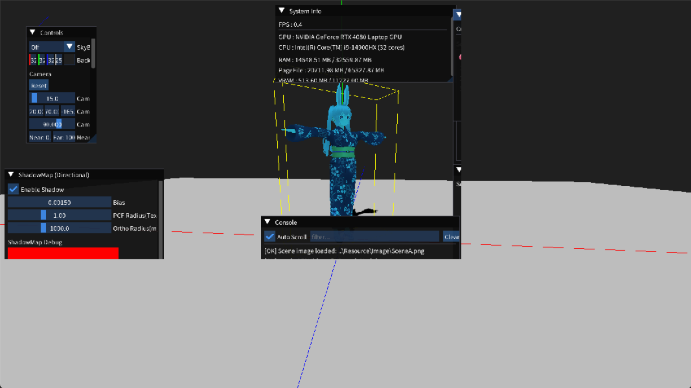](https://github.com/Chang-Jin-Lee/D3D11-AliceTutorial/tree/main/Dx11/29_MousePicking)</div> | <div align="center">[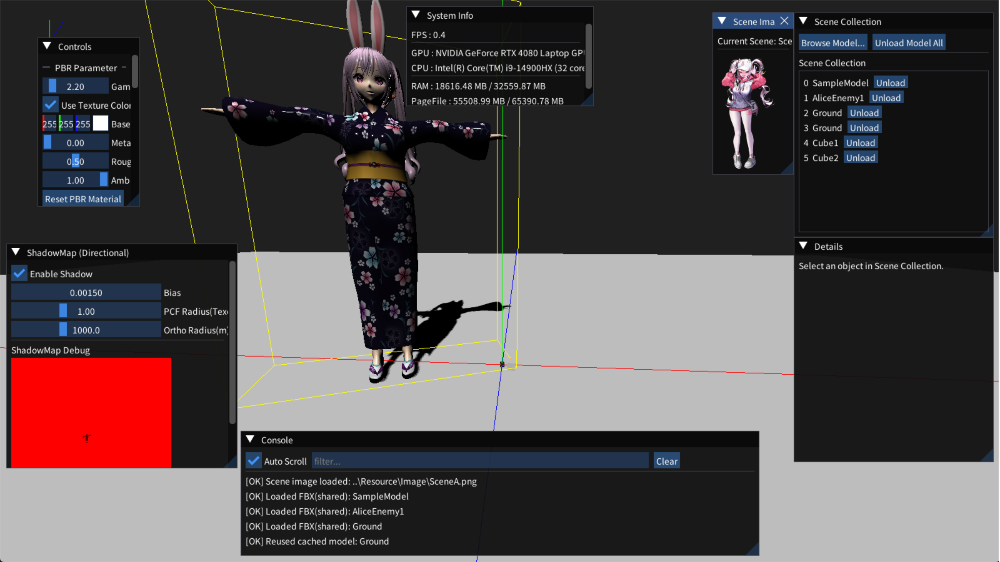](https://github.com/Chang-Jin-Lee/D3D11-AliceTutorial/tree/main/Dx11/30_PBR_BRDF)</div> | <div align="center">[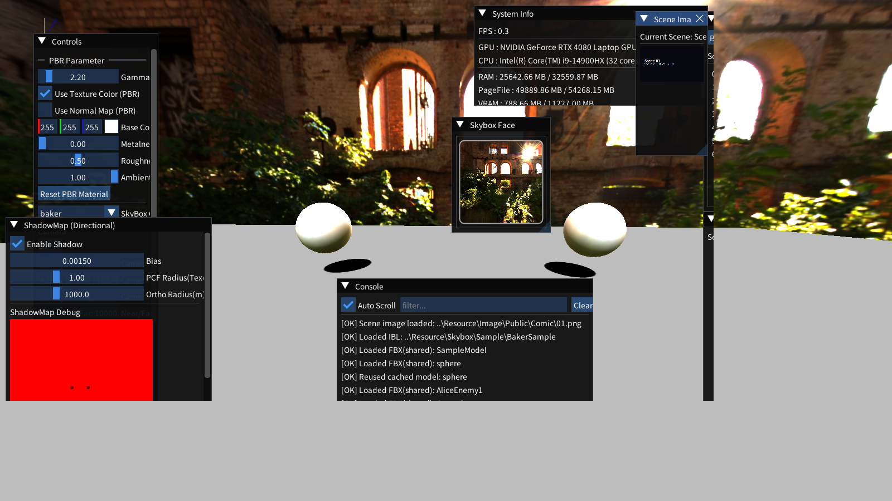](https://github.com/Chang-Jin-Lee/D3D11-AliceTutorial/tree/main/Dx11/31_IBL)</div> | <div align="center">[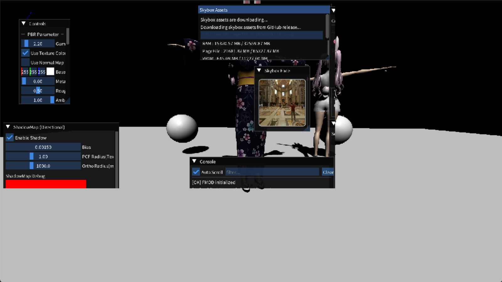](https://github.com/Chang-Jin-Lee/D3D11-AliceTutorial/tree/main/Dx11/32_Sound_FMOD)</div> |

| [33. Sound Animation Camera Motion](https://github.com/Chang-Jin-Lee/D3D11-AliceTutorial/tree/main/Dx11/33_Sound_Animation_Camera_Motion) | [34. Tone Mapping](https://github.com/Chang-Jin-Lee/D3D11-AliceTutorial/tree/main/Dx11/34_ToneMapping) | [35. Deferred Rendering](https://github.com/Chang-Jin-Lee/D3D11-AliceTutorial/tree/main/Dx11/35_DeferredRendering) | [36. Animation+ ](https://github.com/Chang-Jin-Lee/D3D11-AliceTutorial/tree/main/Dx11/36_AdvancedAnim_Sound_Click) |
|---|---|---|---|
| <div align="center">[](https://github.com/Chang-Jin-Lee/D3D11-AliceTutorial/tree/main/Dx11/33_Sound_Animation_Camera_Motion)</div> | <div align="center">[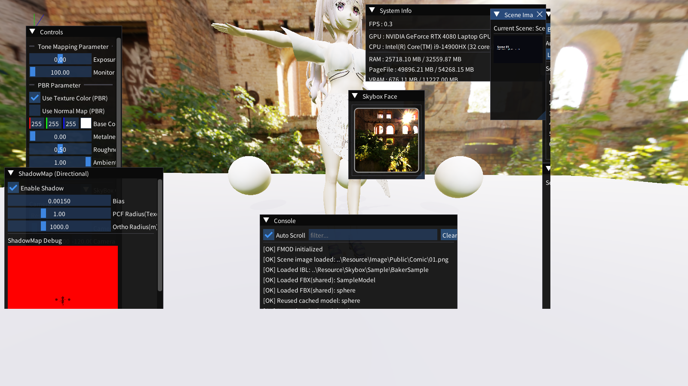](https://github.com/Chang-Jin-Lee/D3D11-AliceTutorial/tree/main/Dx11/34_ToneMapping)</div> | <div align="center">[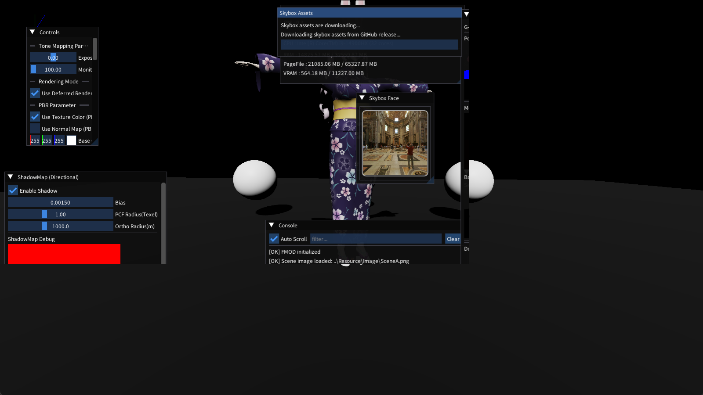](https://github.com/Chang-Jin-Lee/D3D11-AliceTutorial/tree/main/Dx11/35_DeferredRendering)</div> | <div align="center">[](https://github.com/Chang-Jin-Lee/D3D11-AliceTutorial/tree/main/Dx11/36_AdvancedAnim_Sound_Click)</div> |

| [37. imgui-node-editor demo](https://github.com/Chang-Jin-Lee/D3D11-AliceTutorial/tree/main/Dx11/37_Blueprint) | [38. Stylized Toon PBR](https://github.com/Chang-Jin-Lee/D3D11-AliceTutorial/tree/main/Dx11/38_StylizedToonPBR) |
|---|---|
| <div align="center">[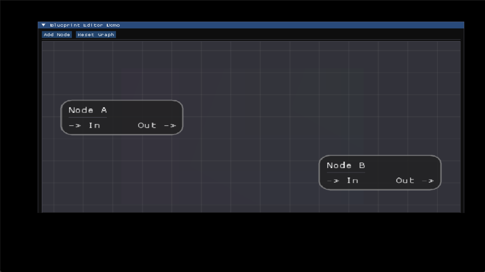](https://github.com/Chang-Jin-Lee/D3D11-AliceTutorial/tree/main/Dx11/37_Blueprint)</div> | <div align="center">[](https://github.com/Chang-Jin-Lee/D3D11-AliceTutorial/tree/main/Dx11/38_StylizedToonPBR)</div> |

---

## 빌드 방식

- 권장 환경: Windows 11, Visual Studio 2022 이상, Windows SDK, MSVC C++ workload
- 솔루션: `Dx11/TutorialApp.sln`
- 기본 플랫폼: `x64`
- vcpkg는 사용하지 않습니다. 필요한 외부 의존성은 `Dx11/third_party` 아래의 repo-local 파일을 참조합니다.
- `37_Blueprint`는 `imgui-node-editor` submodule을 사용합니다. 해당 프로젝트까지 빌드하려면 다음 명령이 필요합니다.

```bash
git submodule update --init --recursive
```

## 의존성 선택 기준

이 프로젝트는 Direct3D 11 렌더링 파이프라인 학습 레포지토리이므로, 패키지 매니저 자체를 학습/빌드의 전제 조건으로 두지 않고 필요한 라이브러리만 고정했습니다.

| 의존성 | 사용 위치 | 선택 이유 | 검토한 대안 |
|---|---|---|---|
| DirectXTK 일부 소스 | `SimpleMath`, 입력, WIC/DDS 텍스처 로딩 | Microsoft가 관리하는 D3D11 보조 라이브러리이며, 기존 코드가 이미 해당 API를 사용합니다. 전체 라이브러리 기능이 아니라 현재 필요한 소스만 `Common`에서 빌드합니다. | 직접 수학/입력/텍스처 로더 작성은 학습 가치는 있지만 교체 범위가 큽니다. NuGet/vcpkg는 사용자는 편할 수 있어도 외부 restore가 필요합니다. |
| Dear ImGui 소스 | 각 샘플의 디버그/툴 UI | 소스 포함 방식이 자연스럽고 외부 런타임 의존성이 없습니다. DX11/Win32 backend만 사용합니다. | 자체 UI 구현은 렌더링 학습보다 UI 구현 비중이 커집니다. 바이너리 패키지는 버전 추적과 재현성이 떨어집니다. |
| Assimp 로컬 DLL/lib/header | FBX, OBJ, PMX, glTF/glb 로딩 | 여러 3D 포맷을 하나의 scene/mesh/material 구조로 읽을 수 있어 포맷별 로더를 직접 유지하지 않아도 됩니다. 이 레포에서는 `FBX`, `OBJ`, `MMD/PMX`, `glTF` importer만 켠 DLL을 사용합니다. | `cgltf`는 glTF 전용이라 가볍지만 FBX/PMX 학습 범위를 잃습니다. 포맷별 직접 구현은 포트폴리오 주제에서 벗어날 만큼 작업량이 큽니다. |
| stb_image | TGA fallback | DirectXTex 전체를 런타임 의존성으로 두지 않고 TGA 한 포맷만 가볍게 처리합니다. | DirectXTex는 텍스처 변환, mipmap, 압축 등 오프라인/툴 파이프라인에 강하지만 이 레포의 런타임 TGA fallback에는 과합니다. |
| FMOD / Live2D Cubism | 사운드/Live2D 예제 | 이미 repo-local SDK 형태로 들어 있어 vcpkg 제거 대상이 아닙니다. | 사운드/Live2D 예제를 제거하면 레포 범위가 줄지만 기존 학습 주제를 잃습니다. |

## 모델 포맷

- 기존: `.fbx`, `.obj`, `.pmx`
- 추가: `.gltf`, `.glb`
- glTF/glb는 별도 로더를 새로 만든 것이 아니라, 기존 `FbxModel` 계열의 Assimp 경로로 로드합니다.
- glTF PBR 재질을 위해 base-color 텍스처는 `aiTextureType_BASE_COLOR`를 먼저 확인하고, 없을 때 기존 diffuse 경로로 fallback합니다.

## 주의사항
- 수학 라이브러리인 DirectXMath 사용
- 셰이더 컴파일을 위해 D3DCompileFromFile 사용
- 텍스처 로딩을 위해 DirectXTK WIC/DDSTextureLoader 사용
- Live2D 예제 프로젝트에서 Cubism SDK 사용

---

## 리소스파일
- IBL Sky박스
  - https://drive.google.com/file/d/1OOaj8Zh-6DOiRWh2kgyWCEB9SRHP6ZtJ/view?usp=sharing
- 캐릭터
  - https://drive.google.com/file/d/1A5OncTPxGswntuw-VTPKlqF8Gsq01n7K/view?usp=sharing

## 참고 자료
- [Direct3D 11 Tutorials (GitHub)](https://github.com/walbourn/directx-sdk-samples/tree/main/Direct3D11Tutorials)  
- [MSDN Direct3D 11 Programming Guide](http://msdn.microsoft.com/en-us/library/windows/apps/ff729718.aspx)  
- [DirectXMath](https://learn.microsoft.com/en-us/windows/win32/dxmath/pg-xnamath-intro)  
- [DirectXTK](https://github.com/microsoft/DirectXTK) / [DirectXTex](https://github.com/microsoft/DirectXTex)  

---

## 라이선스
본 튜토리얼 프로젝트는 학습 목적이며, 원본 샘플은 Microsoft가 제공한 [MIT License](https://github.com/walbourn/directx-sdk-samples/blob/main/LICENSE)에 따라 사용됩니다.
