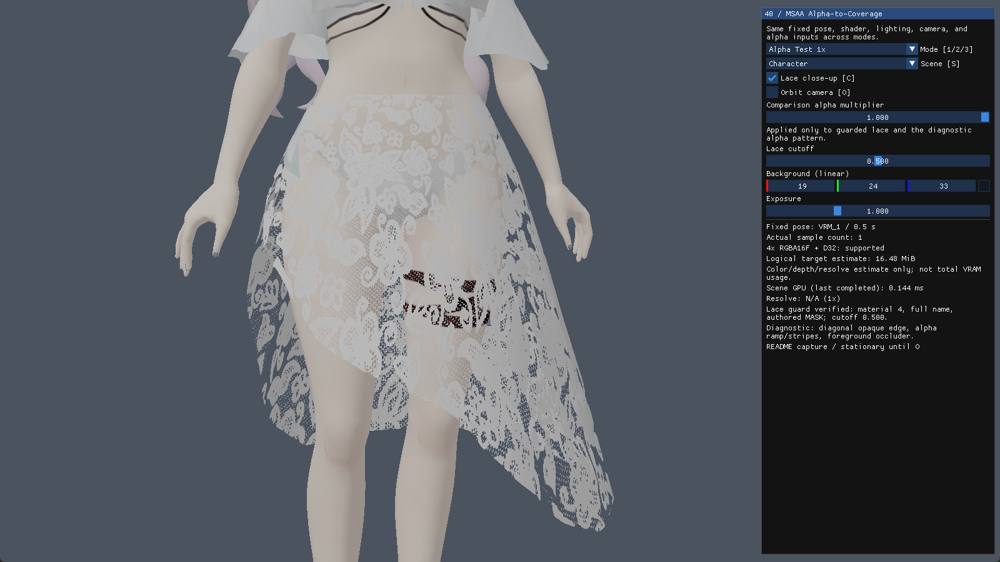
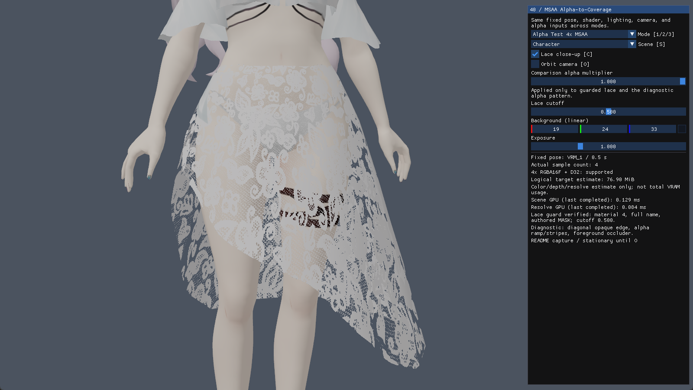
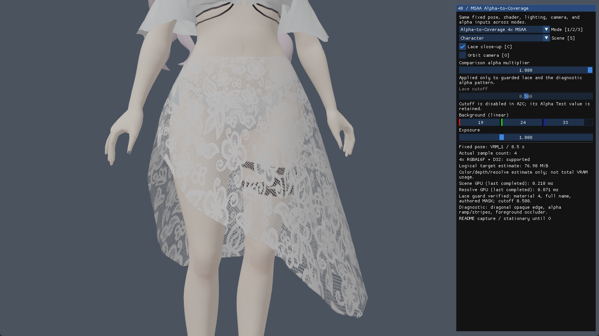

# feat: 40번 MSAA·Alpha-to-Coverage 비교 예제 추가

직접 만든 캐릭터의 치마 레이스로 MSAA와 Alpha-to-Coverage(A2C)를 비교했습니다.

## 화면 비교

같은 포즈와 카메라에서 촬영했습니다. 이미지를 누르면 크게 볼 수 있습니다.

| Alpha Test 1x | Alpha Test 4x MSAA | A2C 4x MSAA |
|---|---|---|
|  |  |  |

이 화면에서는 MSAA만 켜도 레이스 안쪽 무늬는 큰 차이가 없습니다. A2C를 쓰면 무늬가 더 남아 레이스가 덜 거칠게 보입니다.

원본 모델 파일은 수정하지 않았습니다. A2C 모드에서는 비교를 위해 레이스의 알파 처리 방식을 바꿉니다. 각도나 그래픽카드에 따라 결과는 달라질 수 있습니다.

## 직접 비교하기

- `1/2/3`: 세 모드 전환
- `C`: 레이스 확대 / 전신
- `O`: 카메라 회전

화면 오른쪽에서 알파값과 잘라낼 기준값(cutoff)도 조절할 수 있습니다. A2C에서는 cutoff를 사용하지 않습니다.

## 확인한 내용

Debug/Release x64 빌드와 관련 테스트를 통과했습니다. 모드 전환, 창 크기 변경, 최소화 후 복원도 확인했습니다.

코드 설명과 자세한 검사 내용은 [40번 README](../Dx11/40_MSAA_AlphaToCoverage/README.md)에 정리했습니다.
